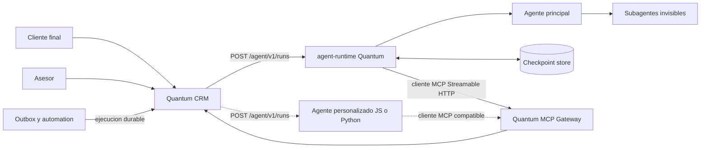
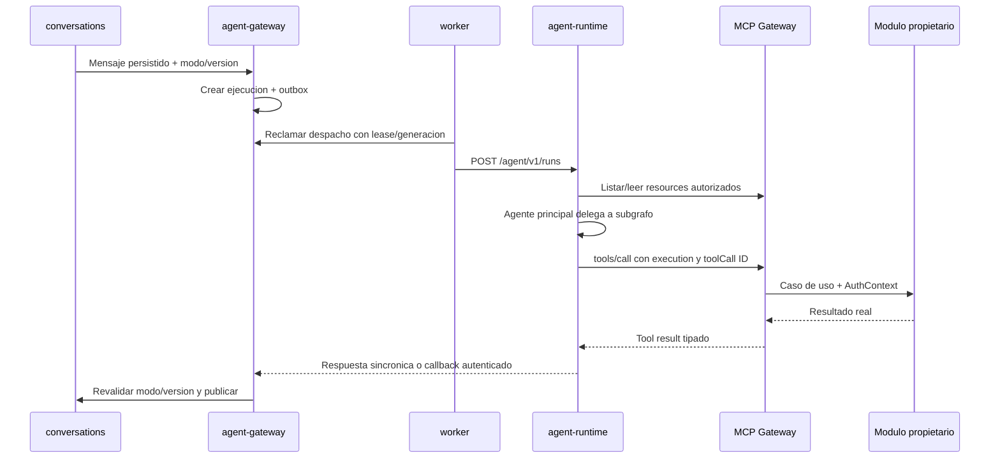

# Arquitectura de agentes LangGraph y Quantum MCP

- Estado: aprobada
- Fecha: 2026-09-16
- Decision gobernante: [ADR-0012](../06-decisiones/ADR-0012-integracion-agentes-langgraph-mcp.md)
- Seguimiento documental: `PROY-018`

## Proposito

Quantum es un CRM agentivo. Cada empresa recibe un agente principal capaz de comprender su entorno autorizado, responder conversaciones y actuar ante eventos aprobados. Los subagentes especializados existen dentro de LangGraph, pero no se presentan como identidades diferentes al usuario.

Esta especificacion define la frontera entre CRM, runtime agentivo y MCP. No acredita implementacion existente ni marca requisitos funcionales como terminados.

## Alcance

Incluye:

- `agent-runtime` oficial TypeScript con LangGraph.js;
- agentes personalizados LangGraph JavaScript o Python;
- contrato `/agent/v1` para ejecuciones;
- Quantum MCP Gateway por perfil;
- resources, tools y prompts de los modulos;
- subagentes, contexto y memoria;
- activacion reactiva y proactiva;
- autenticacion, autorizacion, aprobaciones y aislamiento;
- versionado, evaluacion, fallos y compatibilidad.

No incluye elegir el proveedor o modelo LLM del piloto, definir precios de modelos ni implementar ahora cada tool funcional. Esas selecciones deben respetar esta arquitectura y resolverse antes de activar datos reales.

## Vista general



El agente oficial es primero en el producto, pero separado como proceso. Un agente personalizado ocupa la misma frontera: expone `/agent/v1` al CRM y actua como cliente del MCP del perfil. Ninguno se conecta a bases comerciales, Redis, S3, APIs internas ni administracion de Keycloak; solo su adaptador OAuth usa los endpoints publicados de descubrimiento y token.

## Componentes y propiedad

| Componente | Responsabilidad | No debe hacer |
|---|---|---|
| `agent-runtime` | Ejecutar LangGraph, coordinar subagentes, checkpoints, limites e interrupciones | Acceder a datos comerciales fuera de MCP |
| Quantum MCP Gateway | Negociar MCP y exponer contexto y capacidades autorizadas | Implementar reglas comerciales o escribir tablas directamente |
| `agent-gateway` | Ser propietario del registro durable de conexiones, ejecuciones, estados, threads, callbacks y compatibilidad | Ejecutar tools saltando al modulo propietario |
| `automation` | Crear activaciones proactivas desde eventos y reglas aprobadas | Usar MCP como cola durable |
| Modulos propietarios | Autorizar y ejecutar consultas o comandos reales | Confiar en que el modelo ya valido permiso o invariante |
| Administrador Quantum | Registrar runtime, version, endpoint, salud y rollout | Leer conversaciones o datos comerciales |
| Administrador CRM | Configurar agente, tools, aprobaciones, prompts y alcance | Conceder permisos que su propia identidad no posee |

## Despliegue y aislamiento

Cada perfil despliega un `agent-runtime` oficial o registra un agente personalizado compatible. El oficial usa la misma imagen por digest para todos los perfiles y recibe configuracion separada.

El runtime oficial tiene:

- principal OIDC de agente exclusivo;
- endpoint y red autorizados;
- limites de CPU, memoria, concurrencia y egress;
- base o schema de checkpoints propio con rol exclusivo;
- credencial de carga propia mediante referencia o archivo `*_FILE`, nunca valores compilados;
- identificador de release, grafo, prompts y politica.

El rol de checkpoints no puede conectarse a las bases comercial o administrativa. Los backups y restauraciones del perfil consideran checkpoints cuando existan ejecuciones suspendidas que deban reanudarse; el CRM conserva siempre el estado comercial oficial.

## Contrato de ejecucion `/agent/v1`

El runtime implementa como minimo:

| Operacion | Proposito |
|---|---|
| `GET /agent/v1/manifest` | Versiones, capacidades, lenguaje, runtime y limites soportados |
| `POST /agent/v1/runs` | Crear o reanudar una ejecucion idempotente |
| `POST /agent/v1/runs/{runId}/cancel` | Solicitar cancelacion cooperativa |
| `GET /agent/v1/runs/{runId}` | Consultar y conciliar el estado seguro de una ejecucion |
| `GET /health/live` | Comprobar proceso sin consultar dependencias |
| `GET /health/ready` | Comprobar dependencias esenciales del runtime |

Una ejecucion corta puede responder con resultado terminal. Una larga devuelve `202`, estado recuperable y completa mediante callback autenticado hacia el CRM.

El receptor de callbacks pertenece al CRM, no al runtime:

| Operacion | Proposito |
|---|---|
| `POST /agent/v1/executions/{executionId}/callbacks` en el host CRM | Recibir progreso terminal, interrupcion o error de una ejecucion aceptada |

El schema versionado de callback incluye obligatoriamente `callbackId`, `executionId`, `runId`, `attempt`, `generation`, estado, resultado o error y metadatos permitidos. Usa `Idempotency-Key`, autenticacion de carga con audiencia del CRM y valida conexion, perfil, ejecucion, intento, generacion y modo vigente. La URL se obtiene de la conexion registrada; una solicitud de ejecucion no puede introducir un destino arbitrario.

`agent-gateway` conserva la maquina de estados autoritativa en PostgreSQL CRM:

```text
PENDING -> DISPATCHING -> RUNNING
DISPATCHING -> RETRY_WAIT -> DISPATCHING
DISPATCHING | RETRY_WAIT -> FAILED | TIMED_OUT
DISPATCHING -> SUCCEEDED
RUNNING -> WAITING_APPROVAL -> RUNNING
RUNNING -> SUCCEEDED | FAILED | TIMED_OUT
WAITING_APPROVAL -> FAILED | TIMED_OUT
PENDING | DISPATCHING | RETRY_WAIT | RUNNING | WAITING_APPROVAL -> CANCEL_REQUESTED -> CANCELLED
```

La creacion guarda ejecucion y outbox en la misma transaccion. `worker` reclama el despacho con lease y fencing generation, invoca `/agent/v1` y persiste la aceptacion. Un rechazo o fallo transitorio pasa a `RETRY_WAIT`; al agotar presupuesto termina en `FAILED` o `TIMED_OUT`. Si el envio tuvo resultado incierto, primero concilia con `GET /agent/v1/runs/{runId}` y no crea otro intento mientras pueda existir uno aceptado. Un nuevo intento obtiene nueva generacion.

Una respuesta terminal sincronica contiene `runId`, `attempt`, `generation` y el mismo resultado contractual; `worker` la entrega a la misma funcion de transicion condicional usada por callbacks. Un callback solo aplica una transicion valida; duplicados devuelven el mismo resultado y callbacks de un intento o generacion vencidos no reviven la ejecucion. `automation` conserva la activacion que origino el trabajo y espera el resultado por referencia, pero no posee el lease ni el estado de la ejecucion agentiva.

La solicitud incluye:

- `executionId`, `conversationId` y `threadId` opacos;
- tipo de activacion y referencia al mensaje o evento;
- version esperada de conversacion y modo de atencion;
- contexto inicial compacto;
- endpoint MCP y capabilities requeridas;
- revisiones de agente, prompt y politica;
- correlation, causation e idempotency IDs;
- referencia de callback registrada, intento y fencing generation;
- deadline y presupuestos.

La respuesta terminal incluye solo:

- `executionId`, `runId`, `attempt`, `generation` y estado final;
- mensajes propuestos estructurados;
- tools solicitadas o ya resueltas mediante MCP;
- escalamiento o interrupcion;
- resultado, uso y metadatos permitidos;
- error tipado cuando corresponda.

No incluye cadena de pensamiento, secretos, prompts completos ni trazas internas del proveedor.

## Quantum MCP Gateway

La API del perfil publica un endpoint `/mcp` mediante Streamable HTTP sobre HTTPS. El endpoint valida el token en cada solicitud, negocia la version soportada y anuncia solo capabilities vigentes. Tanto `agent-runtime` como un agente personalizado son clientes de este endpoint; nunca servidores MCP para el CRM.

El gateway mantiene un registro interno por modulo:

```text
module
  -> resource providers
  -> tool providers
  -> prompt providers
  -> schema y version
  -> permisos y politica de riesgo
```

El registro no convierte MCP en propietario de datos. Cada provider adapta un contrato publico del modulo.

### Resources

Los resources permiten que el host decida que contexto incorporar. Ejemplos de URI estable:

```text
quantum://v1/company/profile
quantum://v1/company/settings
quantum://v1/schema/contacts
quantum://v1/conversation/{conversationId}
quantum://v1/contact/{contactId}
quantum://v1/contact/{contactId}/timeline
quantum://v1/opportunity/{opportunityId}
quantum://v1/pipeline/{pipelineId}
quantum://v1/catalog/schema
quantum://v1/calendar/availability{?calendarId,from,to}
quantum://v1/document/{documentId}
quantum://v1/reports/catalog
```

Reglas:

- La lista se filtra por principal, modulo, permiso y configuracion.
- Cada lectura vuelve a autorizar el recurso concreto.
- La respuesta declara schema, version, frescura y paginacion cuando aplique.
- El primer segmento contiene la version mayor. Un cambio incompatible crea `v2`; ambas versiones se anuncian durante la migracion y el manifiesto fija el rango admitido.
- Campos de respuesta compatibles pueden evolucionar dentro de la version mayor conforme al contrato semantico; no se cambia significado ni tipo en silencio.
- Listas grandes se buscan o paginan; no se vuelcan completas al contexto.
- Archivos se representan por metadatos y referencias de acceso corto conforme a [ADR-0013](../06-decisiones/ADR-0013-archivos-almacenamiento-objetos.md); el agente no recibe credenciales S3 ni acceso directo a SeaweedFS.
- Suscripciones optimizan cambios, pero una desconexion exige releer estado autorizado.

### Tools

Los nombres siguen `<module>.<action>.v<major>`, por ejemplo:

```text
contacts.search.v1
sales.create-opportunity.v1
sales.move-opportunity.v1
tasks.create.v1
scheduling.check-availability.v1
scheduling.book.v1
catalog.search.v1
documents.create-quote-draft.v1
conversations.send-message.v1
reporting.query-authorized-metric.v1
contacts.propose-note.v1
settings.propose-preference.v1
```

Cada tool declara:

- descripcion factual sin instrucciones ocultas;
- JSON Schema cerrado de entrada y salida;
- permiso, alcance y recursos afectados;
- clasificacion de riesgo;
- politica de aprobacion;
- timeout, idempotencia y semantica de reintento;
- posibles errores tipados;
- propietario funcional.

El gateway rechaza tools desconocidas, versiones incompatibles, propiedades adicionales no admitidas, argumentos fuera de alcance y claves idempotentes reutilizadas con otro contenido.

### Prompts

Los prompts MCP representan playbooks seleccionables y versionados, no sustituyen las politicas inmutables del runtime. Pueden describir atencion, ventas o seguimiento configurado por la empresa.

- Se separan instrucciones del sistema, configuracion aprobada y contenido no confiable.
- Un cambio crea una revision y conserva autor, fecha y alcance.
- Ningun prompt concede una tool, permiso o aprobacion.
- La activacion declara que revision uso.

## Agente principal y subagentes

El grafo principal contiene enrutamiento, ensamblaje de contexto, presupuestos, delegacion, consolidacion y escalamiento. Los subgrafos iniciales son:

| Subagente | Responsabilidad |
|---|---|
| Conversacion | Intencion, respuesta, tono y escalamiento |
| Ventas | Contactos, oportunidades, pipelines y seguimiento |
| Tareas | Pendientes, recordatorios y coordinacion |
| Agenda | Disponibilidad, reservas y cambios |
| Catalogo | Productos, variantes, servicios, alquileres e inventario visible |
| Documentos | Cotizaciones, facturas, pagos y aprobaciones |
| Analisis | Metricas y reportes autorizados |

No existe un subagente de seguridad que pueda aprobar acciones. Las politicas deterministas rodean todo el grafo.

La delegacion contiene objetivo, IDs, contexto minimo, capabilities, presupuesto y formato de resultado. Un subagente no hereda automaticamente todas las tools ni entrega instrucciones ejecutables a otro mediante texto libre.

## Contexto y memoria

### Contexto inicial

Incluye:

- identidad y configuracion de empresa permitida;
- contacto, conversacion y ultimo mensaje;
- resumen verificable con referencias;
- estado comercial relacionado;
- modo humano o IA y version observada;
- tools, resources y prompts disponibles;
- limites, idioma y zona horaria.

El runtime recupera contexto adicional bajo demanda. La seleccion se registra sin copiar contenido sensible a logs.

### Thread y checkpoints

La clave estable relaciona perfil, conexion de agente, conversacion y version compatible. Un checkpoint conserva memoria de trabajo, interrupciones y estado del grafo; no reemplaza mensajes ni resultados comerciales.

Al cambiar el grafo, cada thread se clasifica como compatible, migrable o reiniciable. Una version nueva no reanuda silenciosamente un checkpoint incompatible.

### Memoria aprendida

No existe un modulo ni una tool generica `memory`. Una deduccion solo se persiste mediante una tool del modulo propietario, por ejemplo `contacts.propose-note.v1`, `settings.propose-preference.v1` o una operacion equivalente de `conversations`. La propuesta contiene fuente, texto o estructura, confianza, alcance, sensibilidad y expiracion. El propietario aplica su autorizacion, retencion y auditoria y decide si queda como nota, preferencia, dato pendiente de confirmacion o rechazo. Si no existe propietario contractual, el runtime no la guarda.

## Activacion reactiva y proactiva

### Reactiva

Un mensaje o comando crea una ejecucion durable. La conversacion se serializa conforme a BASE-03 y ADR-0011.

### Proactiva

Un evento de outbox activa una automatizacion aprobada. La regla determina agente, objetivo, audiencia, horario, tools y necesidad de aprobacion. MCP no inventa disparadores ni sustituye la ejecucion durable.

Ejemplos:

- oportunidad sin seguimiento;
- cita proxima;
- factura vencida;
- formulario recibido;
- cambio de disponibilidad;
- solicitud manual sobre contactos seleccionados.

Cada activacion conserva causation ID y deduplicacion. Un evento repetido no crea doble mensaje, tarea, reserva o cobro.

## Flujo de una conversacion



La respuesta no se publica si cambio el modo, vencio la ejecucion, se perdio el lease o un asesor tomo la conversacion.

## Aprobaciones e interrupciones

Las tools se clasifican:

| Clase | Ejemplo | Regla base |
|---|---|---|
| Lectura | Consultar contacto | Automatica dentro del alcance |
| Borrador | Preparar cotizacion | Sin efecto externo |
| Reversible | Crear tarea | Segun politica del perfil |
| Externa | Enviar mensaje o reservar | Permiso y politica explicitos |
| Sensible | Cobrar, reembolsar, emitir o eliminar | Aprobacion humana obligatoria cuando el dominio lo exija |

Una tool que requiere aprobacion devuelve una operacion pendiente. El grafo se interrumpe y el CRM muestra tool, argumentos, efecto, actor propuesto y vencimiento. Aprobar, editar o rechazar ocurre en el CRM; editar produce argumentos nuevos y una decision nueva.

La reanudacion usa el mismo thread y una referencia a la aprobacion durable. El runtime no confia en un booleano aislado enviado por el modelo.

## Autenticacion y seguridad

- `/agent/v1` y `/mcp` usan identidades de carga diferentes, nunca sesiones humanas compartidas.
- Para llamar `/agent/v1`, `agent-gateway` obtiene un token de cliente confidencial con audiencia del runtime registrado; el runtime valida issuer, audience, expiracion, perfil y scopes.
- Para llamar MCP, el runtime descubre los metadatos del recurso y del authorization server publicados para el endpoint del perfil y obtiene con sus propias credenciales un token corto usando el indicador de recurso y la audiencia canonica del MCP.
- La solicitud `/agent/v1` entrega endpoint MCP, scopes requeridos y `executionId`, pero nunca un token humano ni un token MCP. El runtime renueva obteniendo otro token antes de expirar; no guarda access tokens ni refresh tokens en checkpoints.
- El gateway MCP cruza principal, perfil y `executionId` con el registro server-side. Si existe delegacion humana, aplica la interseccion entre permisos del agente, permisos del actor, configuracion y aprobacion sin reenviar el token del usuario.
- Revocar o rotar una conexion deshabilita su cliente, invalida nuevas llamadas y cancela o expira ejecuciones segun politica. Los callbacks usan otro token con audiencia del CRM.
- El adaptador OAuth puede acceder solo a discovery y token endpoints del realm asignado; no usa APIs administrativas de Keycloak.
- Cada token valida firma, issuer, audience, expiracion, perfil y scopes. Un token recibido para otra audiencia nunca se intercambia ni reenvia de forma implicita.
- El token MCP esta ligado al recurso MCP y no se pasa a modulos o proveedores.
- La delegacion en nombre de un usuario conserva identidad humana y de agente.
- Los argumentos nunca eligen otro perfil ni elevan permisos.
- Egress se limita a destinos registrados y se revalidan DNS, IP, redirects y TLS.
- Secretos de proveedores y credenciales comerciales permanecen en adaptadores del CRM; el runtime recibe unicamente su credencial de carga por el mecanismo de secretos aprobado.
- Datos no confiables se delimitan y reducen; la autorizacion no depende del prompt.
- Salidas y tool calls se validan por schema, tamano, tipo y politica.
- No se conserva cadena de pensamiento; la trazabilidad usa eventos, decisiones y resultados estructurados.

## Presupuestos y circuit breakers

La configuracion efectiva limita por perfil, agente y ejecucion:

- tiempo total y por llamada;
- pasos, subagentes y tool calls;
- reintentos;
- contexto, archivos y salida;
- tokens y costo informado;
- concurrencia y rate limit;
- fallos consecutivos antes de abrir circuito.

Al agotar presupuesto, el agente termina con respuesta segura, operacion fallida recuperable o escalamiento. No continua en segundo plano sin registro.

## Manejo de fallos

| Fallo | Resultado requerido |
|---|---|
| Runtime no disponible | Reintento limitado o escalamiento; no se inventa respuesta |
| MCP no disponible | Ejecucion recuperable y sin tools confirmadas |
| Resource obsoleto | Relectura o conflicto; no overwrite silencioso |
| Tool falla | Resultado tipado al grafo y ninguna confirmacion falsa |
| Resultado externo incierto | Conciliacion antes de repetir |
| Callback duplicado | Mismo resultado idempotente |
| Callback tardio | Rechazo si ejecucion, lease o modo ya no son validos |
| Checkpoint perdido | Reconstruccion desde CRM o escalamiento explicito |
| Thread incompatible | Mantener runtime compatible, migrar o reiniciar con evidencia |
| Toma humana | Cancelar/inutilizar salida pendiente y suspender seguimientos |
| Circuit breaker abierto | Escalar o degradar a atencion humana declarada |

## Versiones y releases

El manifiesto del agente registra:

- digest y commit;
- lenguaje, runtime y version LangGraph;
- grafos y subgrafos;
- contrato `/agent/v1` y protocolo MCP;
- prompts, tools y politicas;
- proveedor, modelo y configuracion no secreta;
- limites y tratamiento de datos;
- datasets, evaluaciones y excepciones.

El manifiesto del CRM declara agentes compatibles. Un rollout comienza en un perfil, observa resultados y se amplia por lotes. Rollback selecciona un digest compatible; no reescribe checkpoints ni datos comerciales.

## Estrategia de pruebas

### Unitarias

- nodos, rutas, limites e interrupciones;
- ensamblaje y reduccion de contexto;
- seleccion de subagente;
- clasificacion de tools y errores;
- compatibilidad de checkpoints.

### Contractuales

- manifest y `/agent/v1`;
- maquina de estados, callback receptor, leases, fencing y deduplicacion;
- inicializacion y negociacion MCP;
- list/read de resources;
- list/call de tools;
- prompts, schemas, errores, cancelacion y callbacks;
- misma suite contra agente oficial, fixture JavaScript y fixture Python.

### Integracion

- runtime, gateway, PostgreSQL de checkpoints, PostgreSQL CRM y Redis aislados;
- dos perfiles y dos principales;
- permisos, aprobaciones, idempotencia y toma humana;
- reintentos, perdida de lease y reinicio.

### Evaluacion de comportamiento

- calidad de respuesta final;
- tool correcta y argumentos validos;
- trayectoria aceptable sin exigir un unico camino cuando existan varios correctos;
- negativa y escalamiento correctos;
- ausencia de confirmaciones falsas;
- latencia, uso y costo.

### Adversariales

- prompt injection directa e indirecta;
- exfiltracion mediante tool o URI;
- tool poisoning y cambio de descripcion;
- memoria contaminada;
- aprobacion alterada o vencida;
- loops, recursion y consumo excesivo;
- datos o tokens de otro perfil.

Los datasets usan datos sinteticos o saneados. LangSmith es opcional; CI conserva una ruta de evaluacion independiente.

## Puerta de aceptacion

La arquitectura no se considera aplicada hasta demostrar:

1. Agente oficial TypeScript separado de API y worker.
2. Agentes LangGraph JavaScript y Python superando el mismo contrato.
3. Un agente principal delegando en subagentes invisibles.
4. Contexto de empresa, conversacion, contacto y modulos consultado bajo demanda por MCP.
5. Recorrido real de lectura, borrador, accion autorizada y escalamiento.
6. Evento proactivo autorizado sin duplicados.
7. Accion sensible detenida hasta aprobacion valida.
8. Toma humana invalidando una respuesta pendiente.
9. Dos perfiles sin cruce de contexto, memoria, tools o credenciales.
10. Fallo de runtime, MCP y tool sin confirmacion falsa.
11. Thread compatible conservado y thread incompatible tratado explicitamente.
12. Evaluaciones contractuales, funcionales y adversariales aprobadas.

## Descomposicion para implementacion

Esta especificacion se ejecuta mediante planes pequenos, no una sola rama:

1. Contratos `/agent/v1`, callback receptor, maquina de estados, manifest y harness de conformidad.
2. Quantum MCP Gateway con OAuth, una resource versionada y una tool de ejemplo.
3. `agent-runtime` oficial, checkpoints y grafo principal minimo.
4. Autenticacion de ambas direcciones, permisos, aprobaciones y aislamiento de dos perfiles.
5. Subagentes y capabilities por modulo conforme avance el MVP.
6. Activaciones proactivas integradas con ADR-0011.
7. Evaluaciones, pruebas adversariales, observabilidad y rollout.

Cada plan referencia requisitos concretos y no marca BASE-01 ni una capacidad de agente terminada hasta completar sus herramientas, pruebas y recorrido integrado.
