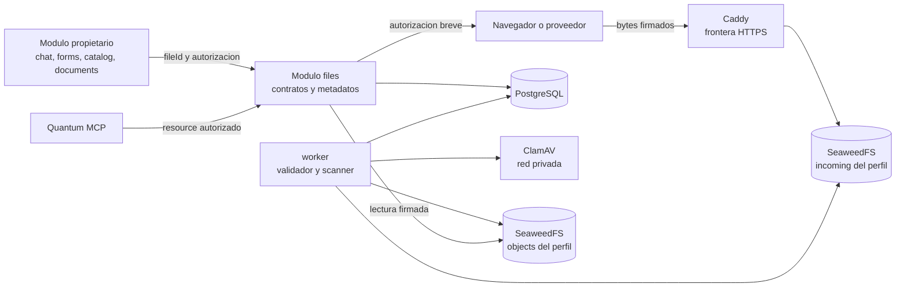
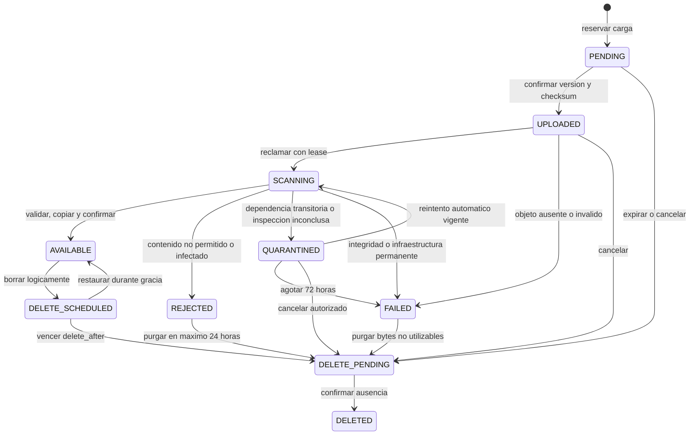
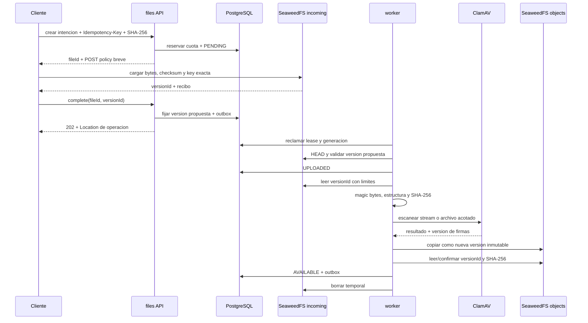

# Arquitectura de archivos y objetos

Este documento especifica como Quantum recibe, valida, almacena, entrega, deriva, retiene y elimina archivos. Deriva de [ADR-0013](../06-decisiones/ADR-0013-archivos-almacenamiento-objetos.md) y no acredita que la implementacion exista.

## Objetivos

- Mantener los bytes de cada perfil aislados aunque compartan un VPS.
- Impedir que contenido no verificado llegue a usuarios, procesos comerciales o agentes.
- Conservar una identidad inmutable y trazable por version de archivo.
- Tolerar reintentos, reinicios y fallos parciales entre PostgreSQL y S3.
- Permitir sustituir SeaweedFS por otro proveedor S3 sin cambiar el dominio.
- Coordinar retencion, borrado y restauracion con las referencias comerciales.

## Componentes y limites



SeaweedFS y ClamAV son servicios auxiliares, no modulos comerciales. `files` pertenece al dominio CRM y es la unica frontera que traduce entre `fileId` y almacenamiento. Caddy no autoriza recursos: solo termina TLS y enruta una operacion ya firmada.

## Aislamiento fisico y credenciales

Cada perfil obtiene dos buckets privados:

```text
qcrm-<tenant-opaque-id>-incoming
qcrm-<tenant-opaque-id>-objects
```

Los nombres se generan desde un identificador opaco registrado; no se aceptan nombres proporcionados por un usuario. El nombre concreto es dato operativo y no forma parte de los contratos comerciales.

Credenciales minimas:

| Principal | `incoming` | `objects` | Listado o administracion |
|---|---|---|---|
| API de cargas | firmar Browser POST con `PutObject` sobre key reservada; no lee cuerpos ni metadatos S3 | ninguna | no lista ni administra |
| Finalizador/scanner/promotor | `Get`, `Head` y `Delete` de la version reclamada | crear version, `Head` y leer para verificar checksum del destino | no lista buckets completos |
| Entrega de archivos | ninguna | firmar o ejecutar `Get` sobre la version autorizada | no lista ni administra |
| Borrado/reconciliacion del worker | `List` solo bajo el prefijo tecnico acotado del perfil, `Head` y `Delete` | `List` acotado, `Head`, `Get` de verificacion y `Delete` | no cambia buckets, politicas ni credenciales |
| `deploy-executor` | provisionar y revocar | provisionar y revocar | buckets, versionado, politicas, cuotas y credenciales |

Una politica S3 se construye desde recursos ya registrados. Ningun proceso recibe comodines sobre buckets de otros perfiles. Los permisos de listado se limitan al bucket y prefijo tecnico del perfil configurado y se usan solo para reconciliacion; una entrada HTTP nunca controla ese prefijo. Staging y produccion usan instancias logicas, buckets, credenciales, claves y datos separados.

La aplicacion separa credenciales de carga, finalizacion/scan/promocion, entrega y mantenimiento aunque `worker` ejecute mas de una funcion. Cada handler recibe solo el cliente correspondiente. El API no puede consultar, borrar ni leer objetos; el proceso de entrega no escribe y el reconciliador no administra politicas.

Los endpoints administrativos y puertos internos de SeaweedFS no se publican. Caddy expone solo el endpoint S3 requerido por cargas y descargas firmadas. `clamd` escucha un socket o red privada sin entrada publica.

## Modelo de metadatos

PostgreSQL conserva al menos:

| Campo | Proposito |
|---|---|
| `file_id` | Identidad opaca publica y estable |
| `tenant_id` | Perfil derivado del contexto verificado |
| `object_key` | Clave interna opaca, nunca elegida por el cliente |
| `original_name_sanitized` | Nombre seguro solo para presentacion o descarga |
| `declared_size` / `observed_size` | Comparar intencion con bytes recibidos |
| `declared_mime` / `detected_mime` | Evidenciar entrada y deteccion real |
| `expected_sha256` / `sha256` | Checksum declarado y checksum calculado sobre la version exacta |
| `proposed_version_id` / `incoming_version_id` / `object_version_id` | Recibo fijado y versiones S3 verificadas en cada zona |
| `state` / `version` | Transicion condicional e idempotente |
| `scan_engine` / `scan_signature` / `scan_result` | Evidencia del analisis aplicado |
| `origin` / `created_by` | Navegador, formulario, proveedor o proceso |
| `owner_module` / `owner_resource_id` | Propietario comercial y recurso inicial |
| `delete_requested_at` / `delete_after` | Borrado logico y fin de la gracia |
| `retention_class` / `expires_at` / `legal_hold` | Politica de conservacion |
| timestamps | Creacion, solicitud de finalizacion, carga, scan, disponibilidad y borrado |

### Protocolo de referencias

`files` conserva una tabla propia de referencias con `tenantId`, `fileId`, `ownerModule`, `ownerType`, `ownerId`, `role`, `ownerVersion` y estado. La clave logica es unica e idempotente. El modulo propietario decide el significado comercial y autoriza el recurso; `files` decide si los bytes y su estado permiten la operacion.

- Para un recurso existente, el modulo propietario autoriza primero y solicita una referencia reservada al crear la intencion.
- Para un recurso que aun no existe, el modulo propietario crea una `attachmentClaim` durable, opaca y con expiracion. La carga se vincula a esa claim, no a un `ownerId` inventado por el cliente.
- Cuando el recurso comercial se confirma, su misma transaccion guarda `fileId` y un evento outbox `files.reference.attach.v1`. El inbox de `files` convierte la reserva en referencia `ACTIVE` de forma idempotente.
- Al retirar una referencia, el modulo propietario modifica su estado y publica `files.reference.detach.v1` en la misma transaccion. Mientras ese evento no se procese, la referencia sigue activa y bloquea el borrado.
- Una claim vencida sin recurso libera su reserva y lleva el archivo a limpieza. Una referencia activa nunca se infiere desde logs, S3 o una consulta directa a tablas ajenas.
- Crear o reactivar una referencia bloquea la fila del archivo y compara su version. Se rechaza en `DELETE_PENDING` o `DELETED`; en `DELETE_SCHEDULED` exige primero una restauracion autorizada.
- La transicion a borrado vuelve a comprobar, bajo el mismo lock, que no existan referencias activas o reservadas, retencion ni legal hold.

No se hace deduplicacion entre perfiles. En el MVP tampoco se comparte un mismo objeto fisico entre archivos distintos del mismo perfil: la identidad y retencion independientes tienen prioridad sobre ahorrar espacio.

## Maquina de estados



- `PENDING`: existe reserva y cuota, pero no se han confirmado bytes.
- `UPLOADED`: el objeto existe en `incoming` y espera validacion.
- `SCANNING`: un worker posee lease y generacion vigentes.
- `AVAILABLE`: el objeto verificado existe en `objects` con checksum confirmado.
- `REJECTED`: el contenido viola permanentemente la politica; no se reintenta y los bytes se purgan en un maximo de 24 horas.
- `QUARANTINED`: ClamAV, sus firmas o un parser no permiten concluir temporalmente. Reintenta con backoff y jitter durante un maximo de 72 horas, consume cuota y no admite consumo.
- `FAILED`: existe fallo permanente de integridad/infraestructura o se agoto la cuarentena. No vuelve al pipeline; se crea una nueva intencion. Solo un reconciliador puede corregir un falso fallo si demuestra, con version y checksum, que el efecto ya habia ocurrido.
- `DELETE_SCHEDULED`: borrado logico; niega lectura y nuevas referencias, conserva bytes y cuota hasta `delete_after`, y permite restauracion autorizada durante la gracia.
- `DELETE_PENDING`: las comprobaciones finales permiten borrar y la operacion durable esta abierta; no admite restauracion ni referencias nuevas.
- `DELETED`: se confirmo ausencia del objeto activo; la evidencia minima permanece.

Cada transicion compara estado, version, lease y generacion. Repetir `complete`, scan, promocion o borrado devuelve el resultado conocido sin duplicar objetos ni referencias.

Clasificacion obligatoria:

| Resultado | Estado | Reintento |
|---|---|---|
| formato prohibido, malware, archivo cifrado o estructura invalida | `REJECTED` | nunca |
| scanner no disponible, firmas antiguas o parser temporalmente saturado | `QUARANTINED` | automatico, acotado a 72 horas |
| version ausente, checksum distinto o fallo permanente agotado | `FAILED` | no sobre el mismo archivo; reconciliar si el resultado fue incierto |
| cancelacion o expiracion | `DELETE_PENDING` | solo nueva intencion |

| Estado | Bytes | Cuota | Lectura comercial | Acciones permitidas |
|---|---|---|---|---|
| `PENDING` | ninguno o version propuesta pendiente de verificar | reservada | no | cargar, completar, finalizar o cancelar |
| `UPLOADED` | `incoming` versionado | consumida | no | escanear o cancelar |
| `SCANNING` | `incoming` versionado | consumida | no | renovar lease, terminar o cuarentena |
| `QUARANTINED` | `incoming` versionado | consumida | no | reintentar, cancelar, agotar |
| `REJECTED` / `FAILED` | temporal hasta 24 horas | consumida hasta purga | no | conservar evidencia y purgar |
| `AVAILABLE` | `objects` versionado | consumida | si, previa autorizacion | referenciar, derivar o solicitar borrado |
| `DELETE_SCHEDULED` | `objects` versionado | consumida | no | restaurar o esperar `delete_after` |
| `DELETE_PENDING` | puede existir hasta confirmar | consumida hasta confirmar | no | borrar y conciliar |
| `DELETED` | ausente del almacen activo | liberada | no | consultar evidencia segura |

## Contratos HTTP

Los schemas viven en `packages/contracts/src/files/http/v1` y generan OpenAPI. Los nombres siguientes son la superficie inicial; su implementacion debe cumplir ADR-0005.

### Crear intencion de carga

`POST /api/v1/files/upload-intents`

Entrada minima:

```json
{
  "owner": {
    "kind": "existing",
    "module": "forms",
    "type": "form_response",
    "id": "opaque-resource-id"
  },
  "fileClass": "document",
  "originalName": "evidencia.pdf",
  "declaredMime": "application/pdf",
  "declaredSize": 120034,
  "expectedSha256": "base64-sha256"
}
```

`owner` es una union discriminada: `existing` exige modulo, tipo e ID autorizados; `claim` acepta exclusivamente una `attachmentClaimId` emitida por el modulo propietario. `expectedSha256` es el SHA-256 de 32 bytes codificado en Base64 RFC 4648 y debe coincidir con el campo checksum de S3.

Requiere `Idempotency-Key`. La API valida permiso o `attachmentClaim`, clase, limite y cuota; crea una sola reserva `PENDING` por clave y hash canonico y devuelve `201 Created`, `Location: /api/v1/files/{fileId}`, expiracion y un formulario POST firmado. Nunca devuelve credenciales S3.

La carga directa inicial es un unico Browser POST; multipart queda deshabilitado. La policy fija bucket, key opaca, `content-length-range`, algoritmo y valor `x-amz-checksum-sha256`, tipo permitido, estado de respuesta y vencimiento maximo de 10 minutos. El bucket `incoming` tiene versionado activo. Reutilizar el formulario puede crear otra version hasta que expire, pero nunca sobrescribe la version ya vinculada al `fileId`; las versiones no vinculadas son huerfanas que purga el reconciliador.

CORS permite solo los origenes registrados, metodo `POST`, headers de formulario/checksum necesarios y expone exclusivamente el identificador de version y recibo requeridos por `complete`. No expone credenciales ni habilita origen comodin.

La version exacta de SeaweedFS debe superar pruebas reales de POST policy, checksum y versionado. Si no cumple alguna capacidad, el despliegue falla `storage:check`; no se debilita el contrato ni se reemplaza el checksum por ETag.

### Confirmar la carga

`POST /api/v1/files/{fileId}/complete`

Requiere `Idempotency-Key` y recibe el `versionId` devuelto por la carga, el checksum y el recibo permitido por el contrato; nunca recibe bucket o key. La API fija una sola version propuesta, registra `completionRequestedAt` y publica outbox sin consultar S3. Una segunda version o un segundo `complete` no sustituye la primera propuesta.

El finalizador del worker consulta esa version exacta con la key guardada, comprueba tamano y checksum almacenado contra la intencion y solo entonces transiciona condicionalmente de `PENDING` a `UPLOADED`. Un recibo inexistente o incompatible termina como `FAILED`; no concede al API una credencial de lectura sobre `incoming`.

Devuelve siempre `202 Accepted`, `Location: /api/v1/operations/{operationId}` y un cuerpo de operacion que enlaza `GET /api/v1/files/{fileId}`. Repetir la misma clave y solicitud devuelve la misma operacion; cambiar el payload con la misma clave produce conflicto. No promete disponibilidad inmediata.

### Consultar metadatos

`GET /api/v1/files/{fileId}`

Devuelve estado y metadatos seguros segun permiso. No expone bucket, key, detalles internos del scanner ni URLs persistentes.

### Autorizar descarga

`POST /api/v1/files/{fileId}/download-authorizations`

Comprueba perfil, permiso, relacion, `AVAILABLE`, retencion y politica de entrega. Devuelve una autorizacion de aproximadamente 60 segundos para `GET` y la `objectVersionId` exacta. La respuesta usa `Cache-Control: no-store`.

La URL es un bearer token reutilizable hasta expirar; no se promete un solo uso. Revocacion inmediata se implementa en la capacidad de Quantum previa a emitirla, no puede retirar una URL S3 ya entregada salvo rotar credenciales o esperar su vencimiento.

### Solicitar eliminacion

`DELETE /api/v1/files/{fileId}`

Requiere `Idempotency-Key`. Registra el borrado logico y una operacion idempotente. Si existen referencias, retencion o legal hold devuelve un conflicto contractual seguro. Devuelve siempre `202 Accepted`, `Location: /api/v1/operations/{operationId}` y el estado `DELETE_SCHEDULED` o `DELETE_PENDING` aplicable; no significa que los bytes ya esten ausentes.

`POST /api/v1/files/{fileId}/restore` exige permiso e `Idempotency-Key`, solo funciona en `DELETE_SCHEDULED` antes de `deleteAfter` y devuelve la misma operacion ante reintentos.

Todas las respuestas de error usan RFC 9457, codigos estables y `correlationId`. Los endpoints aplican rate limit por perfil y clase de operacion.

## Flujo de carga segura



No hay una transaccion distribuida. Si cualquier llamada queda incierta, PostgreSQL conserva la intencion y un reconciliador observa ambos buckets antes de repetir o compensar. Scan y promocion siempre nombran `incomingVersionId`; la copia genera `objectVersionId` y `AVAILABLE` solo se confirma despues de volver a leer su checksum. Una carga posterior sobre la misma key no cambia los bytes escaneados ni promovidos.

## Validacion de contenido

El pipeline aplica en orden:

1. Limite de cuota y tamano declarado antes de firmar.
2. Tamano y checksum que SeaweedFS valido al recibir la version exacta.
3. SHA-256 recalculado por el worker sobre esa misma version y comparado con intencion y metadatos S3.
4. Magic bytes y deteccion MIME independiente.
5. Coherencia con extension saneada y allowlist del caso de uso.
6. Parseo estructural acotado cuando el formato lo requiera.
7. Scan ClamAV con firmas de no mas de 48 horas.
8. Promocion a una version nueva e inmutable y recalculo/verificacion del checksum del objeto destino.

HTML, JavaScript, SVG activo y ejecutables no son adjuntos ordinarios admitidos. ZIP y otros archivos comprimidos comienzan deshabilitados. Habilitarlos exige limites de profundidad, cantidad, expansion y formato que impidan bombas de descompresion.

Archivos cifrados, corruptos o que no puedan inspeccionarse fallan cerrados. Una excepcion futura debe ser un flujo explicito con riesgo, autorizacion y consumo restringido; no un bypass del scanner.

## Limites de recursos

| Clase | Maximo inicial | Procesamiento adicional |
|---|---:|---|
| Imagen | 20 MiB | dimensiones, pixels, formato y metadatos |
| Audio | 50 MiB | duracion y codec permitidos |
| Documento | 50 MiB | paginas, objetos embebidos y parser acotado |
| Video | 250 MiB | duracion, codec y recursos de transcodificacion |

Los procesadores tienen timeout, memoria, CPU, paginas, resolucion y expansion maximos. El worker no carga archivos grandes completos en memoria cuando puede transmitirlos. Un limite de producto puede ser menor que el limite operativo.

## Entrega y enlaces publicos

Todos los objetos permanecen privados. El flujo normal es:

1. El modulo propietario autoriza que el principal vea el recurso comercial.
2. `files` verifica que el `fileId` pertenece al mismo perfil y esta `AVAILABLE`.
3. Se emite una URL firmada para `GET`, object key exacta y vencimiento corto.
4. Caddy entrega por HTTPS sin registrar query strings sensibles.

Un formulario o documento publico usa un token de capacidad de Quantum con alcance, expiracion, revocacion y rate limit. Al validarlo, la aplicacion emite una URL S3 breve. El token publico y la URL S3 no son intercambiables.

El nombre de descarga se sanea y se envia mediante `Content-Disposition`. Los tipos que puedan ejecutar contenido se fuerzan a descarga o se rechazan. CORS contiene solo origenes exactos registrados.

## Derivados y agentes

Thumbnails, previews, texto extraido, transcodificaciones y PDFs se almacenan como nuevos archivos vinculados a:

- `sourceFileId` y checksum exactos;
- tipo y version del procesador;
- parametros normalizados;
- estado y politica de retencion.

Las imagenes destinadas a publicacion eliminan EXIF y otros metadatos no necesarios; el original permanece privado. Un derivado nunca reemplaza silenciosamente el original.

El Quantum MCP Gateway puede ofrecer metadatos, texto extraido o una referencia acotada despues de autorizar el recurso. El `agent-runtime` y sus subagentes no reciben credenciales S3 ni acceso directo a SeaweedFS. Un prompt o documento no cambia permisos, perfil, retencion ni estado.

## Retencion y eliminacion

Politicas iniciales:

| Tipo | Politica |
|---|---|
| Intencion incompleta | pasa a limpieza y libera cuota despues de confirmar ausencia, a las 24 horas |
| Rechazado o infectado | purgar bytes en maximo 24 horas; conservar evidencia segura |
| Cuarentena transitoria | reintentar hasta 72 horas; despues fallar y purgar bytes en maximo 24 horas |
| Derivado regenerable | no sobrevive a su fuente salvo requisito explicito |
| Archivo comercial ordinario | `DELETE_SCHEDULED`, lectura bloqueada y gracia de 30 dias si no hay referencias ni obligacion |
| Enviado, aceptado, firmado, PDF o comprobante | conservar la version exacta mientras aplique obligacion comercial o legal |
| Legal hold | impedir purga hasta liberacion autorizada y auditada |

Los plazos legales por pais pertenecen a la futura politica de privacidad y retencion. ADR-0013 define el mecanismo, no inventa duraciones regulatorias.

La eliminacion de un archivo `AVAILABLE`:

1. Registra solicitud, actor, motivo e idempotency key.
2. Revalida referencias, retencion y legal hold.
3. Transiciona condicionalmente a `DELETE_SCHEDULED`, fija `deleteAfter` a 30 dias y bloquea entrega y referencias nuevas.
4. Permite restaurar a `AVAILABLE` durante la gracia si el mismo control vuelve a validar permisos y obligaciones.
5. Al vencer, vuelve a comprobar referencias, retencion, legal hold y pins de backup bajo lock y transiciona a `DELETE_PENDING`.
6. Elimina la version exacta del objeto y derivados autorizados.
7. Confirma ausencia de esas versiones mediante consulta al almacen.
8. Persiste `DELETED`, libera cuota y emite auditoria/outbox.

`PENDING`, `UPLOADED`, `QUARANTINED`, `REJECTED` y `FAILED` no usan la gracia comercial: cancelacion, expiracion o purga los lleva a `DELETE_PENDING` segun los plazos de su estado. Un archivo en `SCANNING` recibe primero una solicitud de cancelacion durable; el worker comprueba la generacion antes de publicar cualquier resultado y lo lleva a limpieza en un checkpoint seguro.

Si la respuesta de S3 es incierta, no se confirma exito: el reconciliador consulta antes de repetir. Los backups conservan su propia expiracion; la interfaz informa esa realidad y no promete borrado retroactivo inmediato.

## Consistencia y reconciliacion

Trabajos durables cubren:

- reservas `PENDING` vencidas;
- filas `UPLOADED` sin objeto o objetos sin fila;
- scans con lease vencido;
- copias presentes en ambos buckets;
- objeto disponible ausente o con checksum distinto;
- temporales de archivos rechazados;
- borrados pendientes y derivados huerfanos;
- cuotas reservadas sin progreso.

El reconciliador opera dentro de un perfil y con credenciales de minimo alcance. Cada correccion usa transiciones condicionales, deja auditoria y no adopta automaticamente un objeto desconocido como comercial.

## Fallos y degradacion

| Condicion | Comportamiento |
|---|---|
| SeaweedFS no disponible | rechazar o mantener pendiente sin afirmar carga o descarga completada |
| ClamAV no disponible | conservar en cuarentena; no promover |
| Firmas de ClamAV con mas de 48 horas | bloquear promociones y alertar |
| Worker reinicia | lease expira y otro intento reanuda desde estado durable |
| Resultado de copia incierto | observar ambos objetos y checksum antes de repetir |
| PostgreSQL no disponible | no emitir nuevas autorizaciones ni cambiar estado |
| Disco cerca del limite | bloquear nuevas reservas/escrituras antes de llenar el host; mantener lecturas seguras |
| URL filtrada | vence rapidamente; revocar capacidad de Quantum y rotar credencial si corresponde |

Liveness no consulta SeaweedFS ni ClamAV. Readiness de un proceso que firma, escanea o entrega comprueba solo las dependencias indispensables a esa funcion y capacidad minima. La degradacion se expone con codigos seguros y estado operativo, nunca como exito.

## Observabilidad

Eventos y spans usan operaciones acotadas como `file.intent.create`, `file.scan`, `file.promote`, `file.download.authorize` y `file.delete`. Los campos permitidos incluyen `file_id`, estado, clase, resultado, duracion, bytes agrupados y codigos de error controlados.

No se registran:

- contenido o fragmentos del archivo;
- URL firmada o query string;
- nombre original sensible;
- bucket, key o credencial;
- resultados completos de parsers o antivirus.

Metricas agregadas cubren tasa, errores, duracion, bytes, antiguedad por estado, scanner, reconciliacion, cuota y espacio libre. `tenant_id` y `file_id` no son labels.

Alertas minimas: promociones detenidas, firmas desactualizadas, reconciliacion sin progreso, fallos de borrado, diferencia de checksum, disco bajo, cuota agotada y respaldo de objetos fallido.

## Cifrado, secretos y despliegue

- SeaweedFS cifra los objetos en reposo con material entregado mediante secreto montado.
- HTTPS protege las fronteras publicadas; la red interna se limita a servicios necesarios y sigue el modelo de confianza del VPS.
- Credenciales S3, claves de cifrado y configuracion de scanner se separan por entorno y funcion.
- La imagen de SeaweedFS, ClamAV y toda imagen auxiliar se fija por digest y forma parte del inventario de release o plataforma.
- Actualizar un servicio compartido exige compatibilidad, backup, capacidad, ventana y verificacion de todos los perfiles afectados.
- El volumen de SeaweedFS no se elimina ni recrea como parte de una actualizacion de aplicacion.

## Backup y restauracion

[ADR-0015](../06-decisiones/ADR-0015-respaldo-restauracion-continuidad.md) define RPO, RTO, clase de destino externo, cifrado, retencion y pruebas. El contrato de consistencia es:

1. El coordinador adquiere un barrier y una generacion de backup por perfil. Las transiciones que puedan retirar o reemplazar bytes respetan ese fencing.
2. PostgreSQL crea un manifiesto durable dentro del corte consistente de la base. Cada entrada contiene `fileId`, estado, zona, key interna, `versionId` y SHA-256.
3. Las versiones listadas quedan fijadas contra borrado hasta que la copia externa confirme integridad o el backup falle de forma terminal.
4. El copiador lee exactamente las versiones del manifiesto; objetos creados despues pertenecen a otra generacion.
5. La operacion falla si falta una version o su checksum no coincide. No publica una copia parcialmente valida.

El manifiesto incluye:

- todas las versiones de `objects` en `AVAILABLE`, `DELETE_SCHEDULED` y `DELETE_PENDING` que aun existan;
- las versiones de `incoming` en `UPLOADED`, `SCANNING` y `QUARANTINED` para poder reanudarlas;
- metadatos de `PENDING`, aunque una intencion sin `incomingVersionId` se restaura expirada y requiere nueva carga;
- metadatos y evidencia segura de `REJECTED`, `FAILED` y `DELETED`, sin exigir conservar sus bytes purgables;
- configuracion y politicas necesarias para reconstruir buckets y validar el inventario;
- referencias protegidas a claves y secretos mediante su procedimiento propio, nunca sus valores dentro del backup de datos.

La restauracion ocurre primero en un entorno aislado, con envios y automatizaciones externas deshabilitados. Reconstruye buckets privados, restaura las versiones conservadas, verifica el manifiesto completo y solo despues habilita referencias. Cada referencia activa debe resolver al checksum esperado y no puede aparecer un objeto de otro perfil. La arquitectura de [respaldo y continuidad](respaldo-restauracion-continuidad.md) aplica el procedimiento; no se puede cerrar `ADM-15`, `OPS-21` ni la puerta final del piloto hasta implementarlo y restaurarlo con exito.

## Estrategia de pruebas

### Contrato e integracion

- Ejecutar una suite S3 contra la version exacta de SeaweedFS usada en produccion.
- Probar POST policy, checksum, versionado, HEAD de version, copia exacta, lectura de verificacion, borrado y errores reales.
- Usar ClamAV real y la cadena EICAR en infraestructura desechable.
- Probar PostgreSQL, outbox, worker y SeaweedFS juntos; los mocks no acreditan semantica S3.

### Seguridad

- Crear dos perfiles con buckets y credenciales distintas e intentar listar, cargar, copiar, firmar y descargar de forma cruzada.
- Probar URLs expiradas, alteradas y usadas contra otro objeto; demostrar que repetir una URL de descarga dentro de su vigencia no amplía alcance.
- Reutilizar un POST aun vigente y comprobar que crea una version huerfana sin reemplazar la vinculada ni cambiar los bytes escaneados.
- Probar MIME falso, doble extension, polyglots relevantes, archivo cifrado, estructura corrupta, dimensiones extremas y bomba de expansion.
- Comprobar que logs, trazas, errores y artefactos no contienen nombres, bytes, URLs ni secretos canario.

### Recuperacion e idempotencia

- Repetir intencion, complete, scan, promocion y borrado.
- Reiniciar el worker antes y despues de cada efecto S3 y cada escritura PostgreSQL.
- Simular perdida de respuesta con resultado real conocido y desconocido.
- Dejar leases vencidos y verificar que un resultado tardio se rechaza.
- Crear orfandad controlada y comprobar reconciliacion sin adopcion insegura.
- Competir `reference.attach`, `reference.detach`, restauracion y borrado y comprobar que ninguna referencia activa pierde sus bytes.
- Restaurar un manifiesto que incluya objetos disponibles, borrado programado y trabajos en `incoming` y rechazar uno incompleto o con checksum distinto.

### Recorridos

- Chat: recibir, escanear, previsualizar, descargar, enviar y ofrecer referencia MCP autorizada.
- Formularios: carga publica limitada, asociacion unica y acceso posterior autorizado.
- Catalogo: imagenes y documentos ordenados, variantes y sustitucion inmutable.
- Documentos: imagenes, adjuntos, PDF, enlace publico, version aceptada o firmada y comprobante.
- Operacion: cuota, disco bajo, backup y restauracion coordinada.

## Criterios de aceptacion

La capacidad no se considera terminada hasta que:

- el codigo respete la propiedad exclusiva del modulo `files`;
- aislamiento, permisos, scan, inmutabilidad y retencion tengan pruebas reales;
- ningun archivo no disponible pueda consumirse por una ruta alternativa;
- reintentos y reinicios converjan sin objetos perdidos ni efectos duplicados;
- el despliegue observe capacidad y pueda recuperar un perfil desde una copia externa;
- los recorridos de cada requisito afectado funcionen desde su interfaz real.

## Referencias

- [ADR-0013](../06-decisiones/ADR-0013-archivos-almacenamiento-objetos.md)
- [Reglas de archivos y objetos](../05-reglas/13-archivos-objetos.md)
- [SeaweedFS](https://github.com/seaweedfs/seaweedfs)
- [SeaweedFS Security Policy](https://github.com/seaweedfs/seaweedfs/blob/master/SECURITY.md)
- [ClamAV: scanning](https://docs.clamav.net/manual/Usage/Scanning.html)
- [OWASP File Upload Cheat Sheet](https://cheatsheetseries.owasp.org/cheatsheets/File_Upload_Cheat_Sheet.html)
