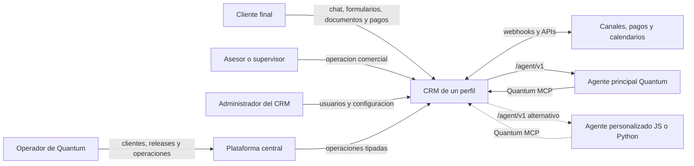
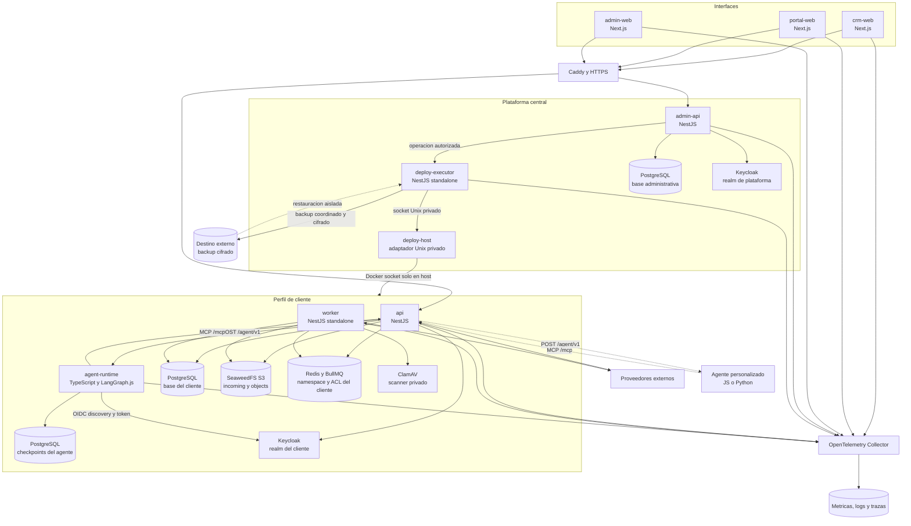
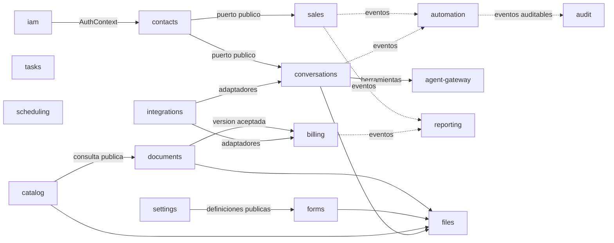
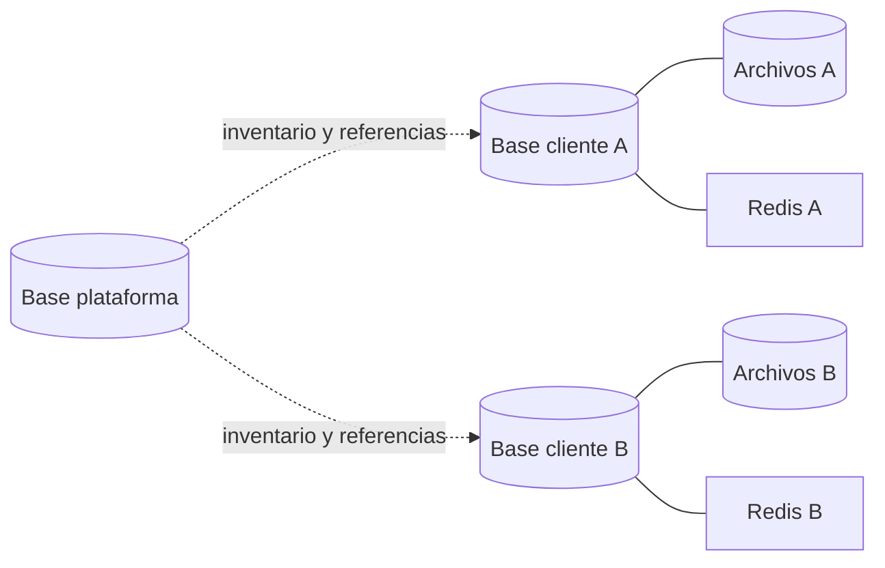
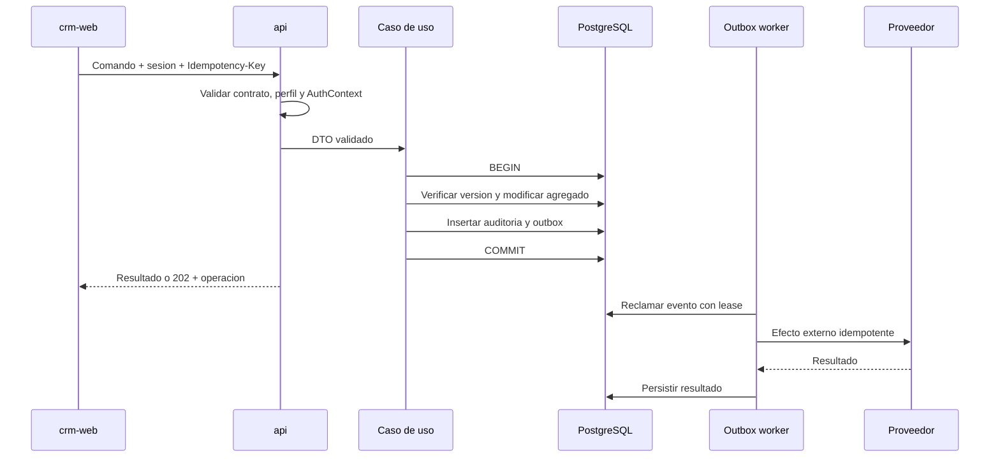
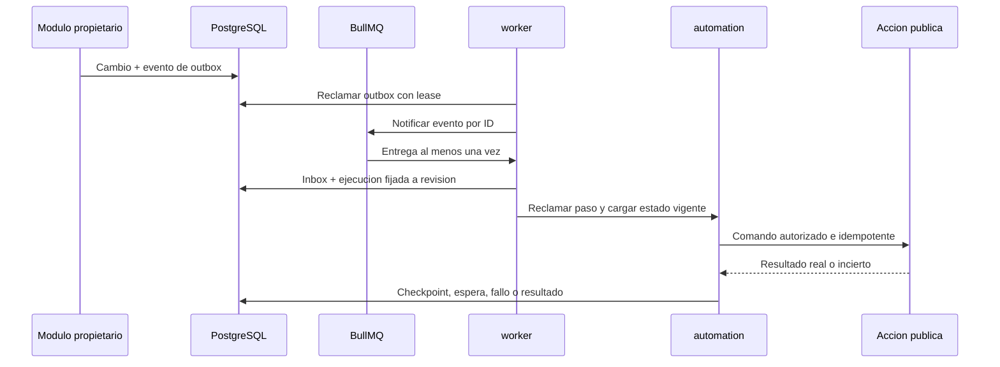
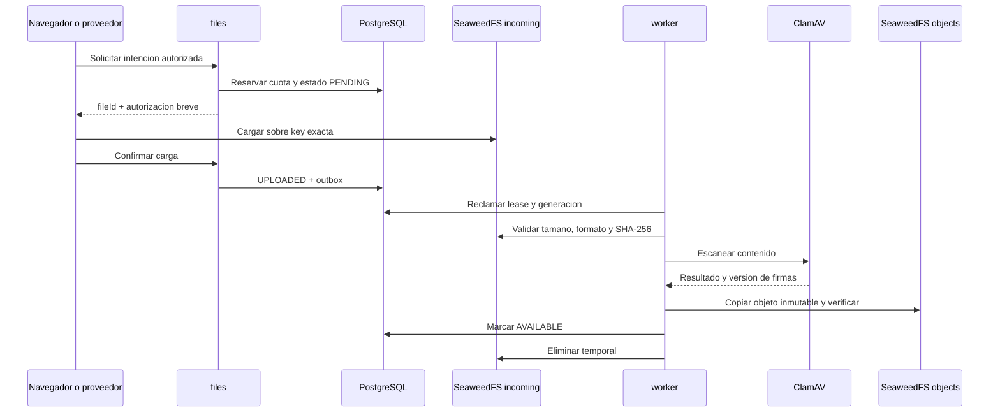
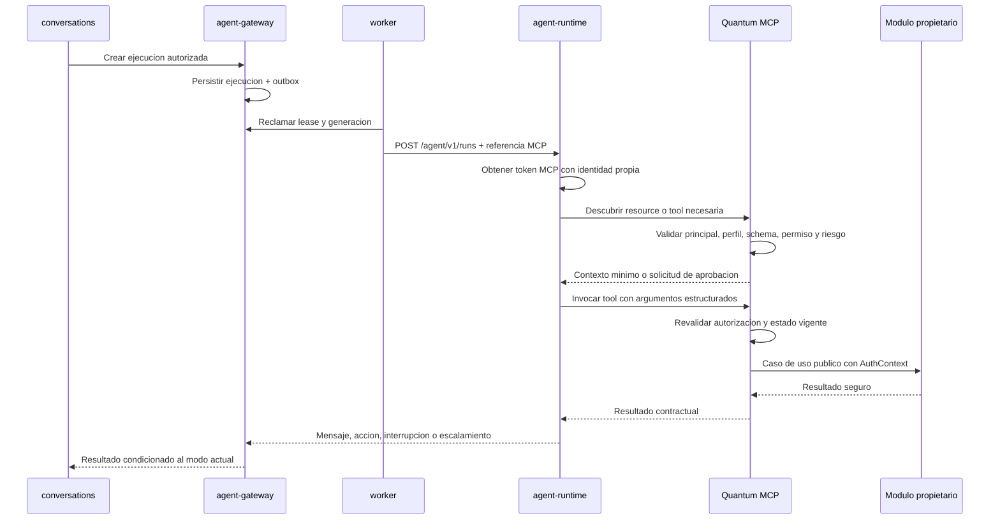
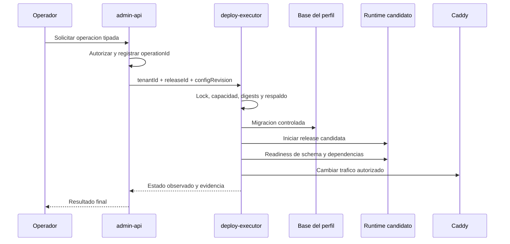

# Mapa del sistema

Este documento ofrece una vista operativa de Quantum CRM. Deriva de ADR-0001 a ADR-0015 y no representa componentes ya implementados.

## Contexto

Quantum es una plataforma que administra perfiles de empresas. Cada perfil ejecuta un CRM aislado con sus propios datos, identidad, configuracion, archivos y procesos. Los operadores de Quantum administran perfiles y despliegues desde una plataforma distinta de los usuarios comerciales.

La flecha de plataforma hacia CRM representa aprovisionamiento y operacion. No autoriza consultas directas a tablas comerciales.

## Contenedores logicos

Los cuadros son limites logicos. PostgreSQL, Redis, SeaweedFS, ClamAV, Keycloak y el VPS pueden compartir infraestructura fisica inicialmente, pero mantienen credenciales y espacios aislados conforme a ADR-0003 y ADR-0013.

## Materializacion actual del bootstrap

La especificacion logica anterior es mas amplia que el codigo disponible. El incremento `OPS-01-c` materializa solo los ocho procesos de aplicacion y sus fronteras de contenedor:

| Proyecto Compose | Procesos incluidos | Estado y limite |
|---|---|---|
| `quantum-local` | ocho aplicaciones | Build integrado en el VPS de pruebas y puertos limitados a loopback; monta referencias PostgreSQL sinteticas solo en procesos autorizados |
| `quantum-test` | `crm-web`, `api` | Smoke de los dos tipos de imagen, sin datos comerciales |
| `quantum-platform` | `admin-web`, `admin-api`, `deploy-executor` | Plantilla por digest; el executor usa operaciones tipadas, una credencial administrativa acotada para `CREATE_DATABASE`, una raiz de secretos y una raiz separada de manifestos por perfil, sin Docker socket ni shell |
| `qcrm-t-<uuid>` | `crm-web`, `portal-web`, `api`, `worker`, `agent-runtime` | Plantilla por perfil y digest; `api` y `worker` reciben una conexion PostgreSQL por archivo secreto; identidad, colas y archivos siguen pendientes |
| `host-adapter` (fuera de Compose) | `deploy-host` | Proceso de infraestructura fuera del plano de aplicación; único propietario del socket Docker y del futuro runner allowlisted, accesible desde `deploy-executor` solo por Unix privado |

`infra/docker/Dockerfile.web` produce las tres variantes Next.js standalone y `infra/docker/Dockerfile.node` produce los procesos Node compilados, incluido el adaptador de infraestructura `deploy-host`. Caddy sera el unico publicador de trafico en los despliegues no locales; las redes externas declaradas son puntos de conexion controlados, no autorizacion para publicar puertos internos.

`OPS-04-a` materializa la frontera inicial de PostgreSQL: `api` y `worker` consumen la base exclusiva de su perfil, `admin-api` consume la base de plataforma y readiness prueba la conexion sin exponer identidad ni URL. `agent-runtime` y las webs no reciben esos secretos. `ADM-04-d` agrega al `deploy-executor` una referencia administrativa separada y de privilegio minimo para crear y reconciliar una base por perfil; `ADM-04-e` agrega credenciales idempotentes en archivos privados y referencias sin valores; `ADM-04-g` materializa un manifiesto no secreto y su referencia durable fuera del checkout antes de iniciar contenedores. `ADM-04-h` define un adaptador Unix privado para que el ejecutor pueda reconciliar Compose sin recibir el socket Docker. Los schemas comerciales, migrador de perfil y pasos posteriores siguen pendientes.

Los componentes de identidad, Redis, archivos, proxy, telemetria y respaldo permanecen como arquitectura aprobada pendiente de sus requisitos operativos. La existencia de una plantilla Compose no acredita instalacion persistente en el VPS, imagen publicada, SBOM, procedencia, escaneo ni release desplegada.

## Responsabilidad de cada aplicacion

| Aplicacion | Responsabilidad | No debe hacer |
|---|---|---|
| `crm-web` | Experiencia de usuarios de cada CRM, BFF y sesion web | Acceder a bases, contener reglas comerciales o exponer tokens OIDC |
| `portal-web` | Autoservicio responsive y white-label para clientes finales, con BFF y audiencia propia | Exponer operacion interna, datos ajenos, telemetria o funciones de plataforma |
| `admin-web` | Experiencia de operadores de Quantum | Usar sesiones de CRM o ejecutar comandos de host |
| `api` | HTTP, WebSocket y casos de uso comerciales | Ejecutar trabajos largos, migraciones o acceder a otros perfiles |
| `worker` | Outbox, inbox, automatizaciones, integraciones y trabajos duraderos | Exponer controladores publicos innecesarios o saltar autorizacion de comandos |
| `agent-runtime` | Agente principal, subagentes internos, grafo, checkpoints e interrupciones | Acceder directamente a datos comerciales, proveedores, secretos o infraestructura interna |
| `admin-api` | Perfiles, releases, servidores, operaciones y auditoria de plataforma | Consultar tablas comerciales o acceder al daemon Docker |
| `deploy-executor` | Ejecutar operaciones de infraestructura tipadas y reportar estado mediante el adaptador Unix | Aceptar shell arbitrario, el socket Docker o credenciales de usuarios comerciales |
| `deploy-host` | Ejecutar el futuro runner allowlisted de Compose y observar recursos del perfil | Aceptar shell, rutas libres, proyectos no derivados del UUID o solicitudes fuera del contrato |

## Modulos comerciales

El diagrama muestra relaciones representativas, no una lista de imports. Todos los modulos se comunican por contratos publicos o eventos y conservan la propiedad definida en ADR-0002.

`files` es propietario exclusivo de metadatos, claves y acceso S3. Los modulos comerciales conservan `fileId`, autorizan su recurso y usan el contrato publico de `files`; no conocen buckets, object keys ni credenciales.

## Modulos de plataforma

| Modulo | Datos y responsabilidad |
|---|---|
| `platform-iam` | Operadores, membresias, roles y MFA requerido |
| `tenants` | Identidad, estado, hostname, ubicacion y ciclo de vida de perfiles |
| `infrastructure` | VPS, capacidad, recursos y asignaciones |
| `releases` | Versiones, commits, digests, contratos y compatibilidad |
| `deployments` | Operaciones, locks, pasos, progreso y resultado observado |
| `backups` | Inventario, politicas, ejecuciones y pruebas de restauracion |
| `platform-monitoring` | Salud, capacidad, alertas y estado observado |
| `platform-audit` | Acciones administrativas append-only |

## Fronteras de datos

- La plataforma guarda inventario operativo, no replicas de datos comerciales.
- Un proceso de A no recibe credenciales de B.
- Una base logica o prefijo de Redis no constituye por si solo una barrera.
- Respaldar o restaurar un cliente coordina su base, archivos, configuracion e identidad.

Cada perfil recibe buckets privados `incoming` y `objects`. Los bytes de entrada no confiables permanecen en `incoming` hasta validar formato, checksum y scan ClamAV; solo los objetos `AVAILABLE` pasan a `objects` y pueden consumirse.

## Flujo de un comando comercial

Ninguna llamada al proveedor ocurre dentro de la transaccion comercial.

## Flujo de una automatizacion

PostgreSQL conserva la definicion, revision, ejecucion, espera, checkpoint e idempotencia. BullMQ distribuye y acelera; si Redis pierde su estado, un reconciliador reconstruye notificaciones desde registros durables. Antes de cada efecto se vuelven a comprobar permisos, invariantes, cancelacion y modo de atencion.

## Flujo de un archivo

PostgreSQL es la autoridad del estado. No existe transaccion distribuida con S3: outbox, idempotencia y reconciliadores resuelven cargas vencidas, objetos huerfanos, copias inciertas y borrados pendientes. La especificacion completa vive en [archivos-objetos.md](archivos-objetos.md).

## Flujo de un agente

El modelo no selecciona el perfil ni aumenta permisos mediante argumentos. El agente principal puede delegar en subagentes internos invisibles, pero estos reciben solo las capabilities y el presupuesto de su tarea. El CRM conserva el estado comercial; el checkpoint del grafo no lo sustituye. El contrato completo esta en [agentes-mcp.md](agentes-mcp.md).

## Flujo de despliegue

## Protocolos

| Necesidad | Mecanismo |
|---|---|
| Comandos y consultas | REST JSON y OpenAPI 3.1.x |
| Chat y eventos interactivos | WebSocket autenticado y reanudable |
| Progreso administrativo | SSE mas recurso REST de operacion |
| Efectos asincronos | Outbox, BullMQ e inbox idempotente |
| Automatizaciones y esperas | Revisiones y ejecuciones en PostgreSQL; BullMQ como distribucion recuperable |
| Eventos entre procesos o sistemas | Envelope CloudEvents y AsyncAPI |
| Ejecucion de agentes | `/agent/v1` sobre HTTP con JSON Schema versionado y cancelacion explicita |
| Contexto y acciones agentivas | MCP Streamable HTTP en `/mcp`, con resources, tools y prompts acotados |
| Proveedores | Adaptadores y webhooks autenticados |

La telemetria no es autoridad de auditoria ni estado comercial. Las aplicaciones emiten OpenTelemetry y logs JSON hacia un Collector interno; el backend puede ser el perfil Grafana autocontenido o un servicio OTLP administrado segun capacidad y requisitos operativos.

## Fallos y recuperacion

| Fallo | Comportamiento esperado |
|---|---|
| Redis se pierde | PostgreSQL conserva operaciones pendientes recuperables |
| Worker reinicia | Lease expira y otro consumidor reanuda sin duplicar efectos |
| Trabajo se entrega dos veces | Inbox, clave idempotente y transicion condicional conservan un solo efecto |
| Worker termina despues de perder el lease | Su resultado tardio se rechaza y la ejecucion continua desde el ultimo checkpoint |
| Proveedor no responde | Se registra intento y se reintenta segun politica |
| Resultado externo queda incierto | Se concilia antes de repetir pagos, reservas, mensajes o emisiones |
| WebSocket o SSE se corta | Cliente reanuda con cursor o reconstruye snapshot |
| Agente responde tarde | Callback autenticado valida ejecucion, intento, lease, generacion, conversacion y modo actual antes de transicionar |
| `agent-runtime` reinicia | Reanuda solo un thread compatible desde checkpoint; en otro caso migra o reinicia de forma explicita |
| MCP queda indisponible | La ejecucion se detiene o escala sin inventar contexto ni repetir efectos inciertos |
| SeaweedFS queda indisponible | La carga, promocion o entrega permanece pendiente o falla de forma recuperable sin confirmar bytes no observados |
| ClamAV queda indisponible o desactualizado | Los archivos permanecen en cuarentena y no alcanzan `AVAILABLE` |
| El disco se aproxima al limite | Se bloquean nuevas escrituras antes del agotamiento y se mantienen lecturas seguras cuando sea posible |
| Una copia o eliminacion S3 queda incierta | Un reconciliador observa estado y checksum antes de repetir o confirmar |
| Migracion falla | Perfil no cambia a version observada nueva |
| Release candidata falla | Trafico permanece o vuelve a version compatible anterior |
| VPS se pierde | Se reconstruye desde inventario, imagenes y respaldo externo verificado |

## Decisiones relacionadas

- `ADR-0001`: stack y procesos.
- `ADR-0002`: limites modulares.
- `ADR-0003`: aislamiento por perfil.
- `ADR-0004`: identidad y permisos.
- `ADR-0005`: APIs y contratos.
- `ADR-0006`: persistencia y migraciones.
- `ADR-0007`: pruebas y calidad.
- `ADR-0008`: entornos, configuracion y secretos.
- `ADR-0017`: secretos idempotentes de base por perfil.
- `ADR-0018`: ejecucion restringida de Compose por perfil.
- `ADR-0009`: integracion, entrega y releases.
- `ADR-0010`: observabilidad y manejo de fallos.
- `ADR-0011`: trabajos asincronos y automatizaciones durables.
- `ADR-0012`: agentes LangGraph y Quantum MCP.
- `ADR-0013`: archivos y almacenamiento de objetos.
- `ADR-0014`: tres frontends y sistema visual.
- `ADR-0015`: respaldo, restauracion y continuidad.

## Aspectos pendientes

Este mapa no decide aun:

- Proveedores concretos de canales, calendario, pagos y facturacion.
- Dimensionamiento y distribucion real del VPS.
- Objetivos SLO de disponibilidad; los RPO y RTO iniciales se fijan en ADR-0015.
