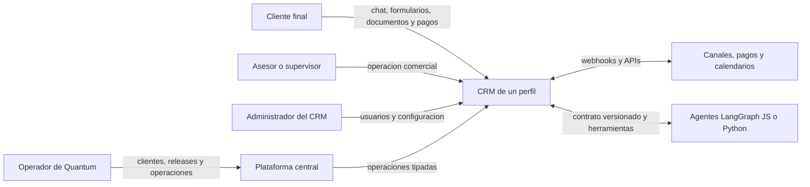
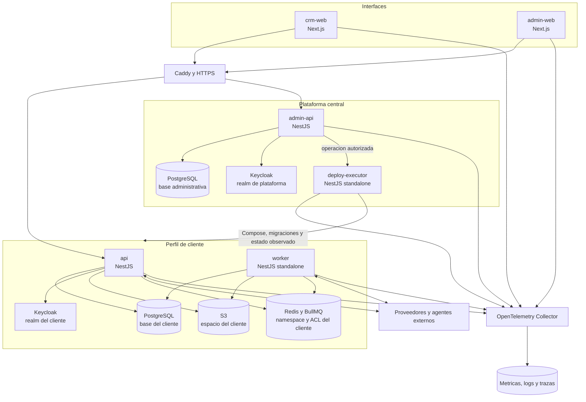
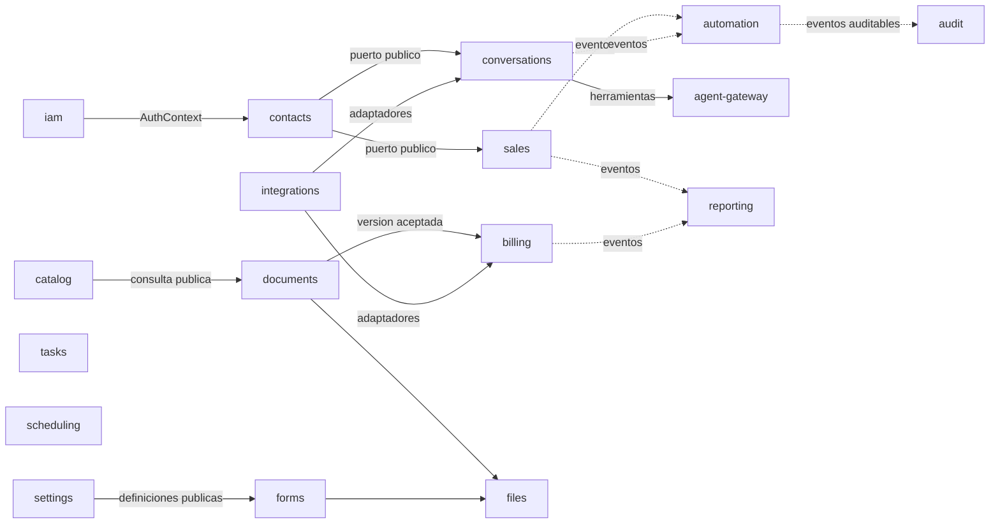
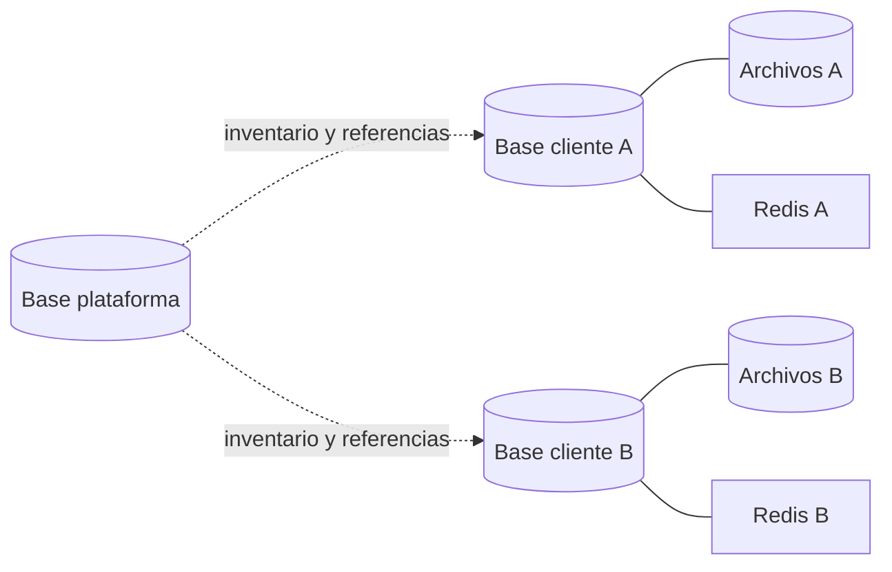
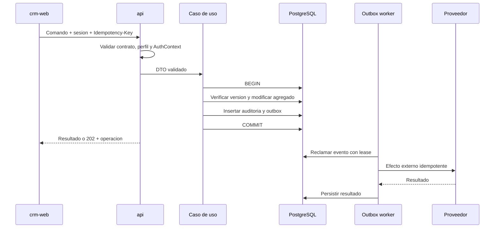
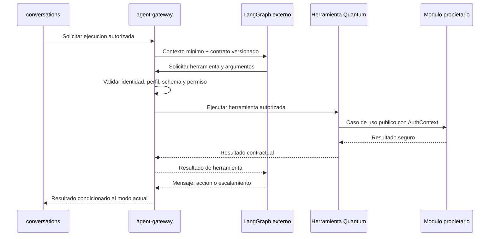
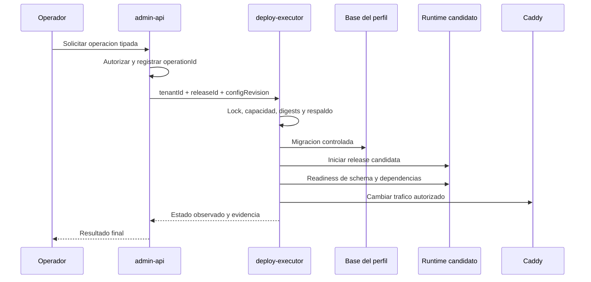

# Mapa del sistema

Este documento ofrece una vista operativa de Quantum CRM. Deriva de ADR-0001 a ADR-0010 y no representa componentes ya implementados.

## Contexto

Quantum es una plataforma que administra perfiles de empresas. Cada perfil ejecuta un CRM aislado con sus propios datos, identidad, configuracion, archivos y procesos. Los operadores de Quantum administran perfiles y despliegues desde una plataforma distinta de los usuarios comerciales.

La flecha de plataforma hacia CRM representa aprovisionamiento y operacion. No autoriza consultas directas a tablas comerciales.

## Contenedores logicos

Los cuadros son limites logicos. PostgreSQL, Redis, S3, Keycloak y el VPS pueden compartir infraestructura fisica inicialmente, pero mantienen credenciales y espacios aislados conforme a ADR-0003.

## Responsabilidad de cada aplicacion

| Aplicacion | Responsabilidad | No debe hacer |
|---|---|---|
| `crm-web` | Experiencia de usuarios de cada CRM, BFF y sesion web | Acceder a bases, contener reglas comerciales o exponer tokens OIDC |
| `admin-web` | Experiencia de operadores de Quantum | Usar sesiones de CRM o ejecutar comandos de host |
| `api` | HTTP, WebSocket y casos de uso comerciales | Ejecutar trabajos largos, migraciones o acceder a otros perfiles |
| `worker` | Outbox, inbox, automatizaciones, integraciones y trabajos duraderos | Exponer controladores publicos innecesarios o saltar autorizacion de comandos |
| `admin-api` | Perfiles, releases, servidores, operaciones y auditoria de plataforma | Consultar tablas comerciales o acceder al daemon Docker |
| `deploy-executor` | Ejecutar operaciones de infraestructura tipadas y reportar estado | Aceptar shell arbitrario o credenciales de usuarios comerciales |

## Modulos comerciales

El diagrama muestra relaciones representativas, no una lista de imports. Todos los modulos se comunican por contratos publicos o eventos y conservan la propiedad definida en ADR-0002.

## Modulos de plataforma

| Modulo | Datos y responsabilidad |
|---|---|
| `platform-iam` | Operadores, membresias, roles y MFA requerido |
| `tenants` | Identidad, estado, hostname, ubicacion y ciclo de vida de perfiles |
| `infrastructure` | VPS, capacidad, recursos y asignaciones |
| `releases` | Versiones, commits, digests, contratos y compatibilidad |
| `deployments` | Operaciones, locks, pasos, progreso y resultado observado |
| `backups` | Inventario, politicas, ejecuciones y pruebas de restauracion |
| `platform-monitoring` | Salud, capacidad, alertas y estado observado |
| `platform-audit` | Acciones administrativas append-only |

## Fronteras de datos

- La plataforma guarda inventario operativo, no replicas de datos comerciales.
- Un proceso de A no recibe credenciales de B.
- Una base logica o prefijo de Redis no constituye por si solo una barrera.
- Respaldar o restaurar un cliente coordina su base, archivos, configuracion e identidad.

## Flujo de un comando comercial

Ninguna llamada al proveedor ocurre dentro de la transaccion comercial.

## Flujo de un agente

El modelo no selecciona el perfil ni aumenta permisos mediante argumentos.

## Flujo de despliegue

## Protocolos

| Necesidad | Mecanismo |
|---|---|
| Comandos y consultas | REST JSON y OpenAPI 3.1.x |
| Chat y eventos interactivos | WebSocket autenticado y reanudable |
| Progreso administrativo | SSE mas recurso REST de operacion |
| Efectos asincronos | Outbox, BullMQ e inbox idempotente |
| Eventos entre procesos o sistemas | Envelope CloudEvents y AsyncAPI |
| Agentes | HTTP y JSON Schema versionados; callback para ejecuciones largas |
| Proveedores | Adaptadores y webhooks autenticados |

La telemetria no es autoridad de auditoria ni estado comercial. Las aplicaciones emiten OpenTelemetry y logs JSON hacia un Collector interno; el backend puede ser el perfil Grafana autocontenido o un servicio OTLP administrado segun capacidad y requisitos operativos.

## Fallos y recuperacion

| Fallo | Comportamiento esperado |
|---|---|
| Redis se pierde | PostgreSQL conserva operaciones pendientes recuperables |
| Worker reinicia | Lease expira y otro consumidor reanuda sin duplicar efectos |
| Proveedor no responde | Se registra intento y se reintenta segun politica |
| WebSocket o SSE se corta | Cliente reanuda con cursor o reconstruye snapshot |
| Agente responde tarde | Callback valida ejecucion, conversacion y modo actual |
| Migracion falla | Perfil no cambia a version observada nueva |
| Release candidata falla | Trafico permanece o vuelve a version compatible anterior |
| VPS se pierde | Se reconstruye desde inventario, imagenes y respaldo externo verificado |

## Decisiones relacionadas

- `ADR-0001`: stack y procesos.
- `ADR-0002`: limites modulares.
- `ADR-0003`: aislamiento por perfil.
- `ADR-0004`: identidad y permisos.
- `ADR-0005`: APIs y contratos.
- `ADR-0006`: persistencia y migraciones.
- `ADR-0007`: pruebas y calidad.
- `ADR-0008`: entornos, configuracion y secretos.
- `ADR-0009`: integracion, entrega y releases.
- `ADR-0010`: observabilidad y manejo de fallos.

## Aspectos pendientes

Este mapa no decide aun:

- Proveedores concretos de canales, calendario, pagos y facturacion.
- Dimensionamiento y distribucion real del VPS.
- Objetivos SLO, RPO y RTO.
- Detalle del motor de automatizaciones y del contrato de agentes.
- Arquitectura de componentes y experiencia visual del frontend.
