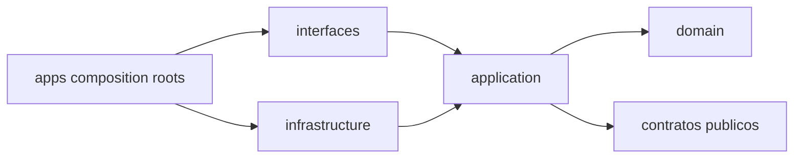

# Especificacion del monorepo

Esta es la estructura objetivo para implementar el stack aprobado. Actualmente describe trabajo futuro; no acredita que las carpetas o aplicaciones existan.

## Principios

- Un repositorio y una historia de Git para producto, contratos, migraciones e infraestructura declarativa.
- TypeScript estricto para todo el codigo propio del producto.
- Aplicaciones desplegables separadas de paquetes reutilizables.
- Modulos organizados por capacidad comercial, no por tipo tecnico global.
- Contratos publicos con un unico punto de entrada; imports internos prohibidos.
- Una misma release produce artefactos inmutables para todos los perfiles.
- Configuracion y datos particulares no se compilan en el codigo.

## Arbol objetivo

```text
/
  apps/
    crm-web/
    admin-web/
    api/
    worker/
    agent-runtime/
    admin-api/
    deploy-executor/

  packages/
    domain/
      src/
        shared/
        iam/
        settings/
        contacts/
        conversations/
        sales/
        tasks/
        scheduling/
        forms/
        catalog/
        documents/
        billing/
        automation/
        agent-gateway/
        integrations/
        reporting/
        audit/
        files/

    platform-domain/
      src/
        shared/
        platform-iam/
        tenants/
        infrastructure/
        releases/
        deployments/
        backups/
        platform-monitoring/
        platform-audit/

    contracts/
      src/
        shared/
        <module>/http/v1/
        <module>/events/v1/
        <module>/mcp/v1/
        agents/v1/

    database/
      prisma/
        crm/
          schema.prisma
          migrations/
        platform/
          schema.prisma
          migrations/
        agent/
          migrations/
      src/
        crm/
        platform/
        agent/

    auth/
    ui/
    config/
    observability/
    testing/

  tests/
    architecture/
    contracts/
    integration/
    files/
    agents/
    e2e/

  infra/
    compose/
      local/
      platform/
      tenant/
    caddy/
    keycloak/
    storage/
      seaweedfs/
      clamav/
    observability/
      collector/
      dashboards/
      alerts/
    scripts/

  docs/
  .github/
```

Los nombres de modulos provienen de ADR-0002. Agregar, fusionar o retirar uno requiere actualizar ese mapa y registrar una decision si cambia responsabilidades.

## Aplicaciones

### crm-web

- Next.js 16 y React.
- Interfaz del CRM y BFF para sesion web.
- Consume contratos del CRM y componentes de `ui`.
- No importa `database`, adaptadores, Prisma ni dominios de plataforma.

### admin-web

- Next.js 16 y React.
- Interfaz exclusiva para operadores de Quantum.
- Consume contratos administrativos y `ui`.
- No reutiliza sesion, clientes ni permisos del CRM.

### api

- NestJS 11.
- Compone modulos comerciales, REST y WebSocket.
- Traduce transporte a casos de uso y aplica `AuthContext`.
- Usa adaptadores de base, autenticacion, archivos e integraciones.
- No procesa colas indefinidamente ni ejecuta migraciones.

### worker

- Proceso NestJS standalone.
- Procesa outbox, BullMQ, inbox, automatizaciones, webhooks salientes y tareas programadas.
- Usa los mismos casos de uso y contratos que API.
- No crea rutas HTTP publicas salvo health interno estrictamente necesario.
- Ejecuta validacion, scan, promocion, derivados, reconciliacion y borrado durable de archivos sin convertir Redis en fuente de verdad.

### agent-runtime

- TypeScript estricto y LangGraph.js.
- Ejecuta el agente principal y subagentes internos invisibles.
- Implementa `/agent/v1` y actua como host y cliente del Quantum MCP Gateway.
- Persiste solo checkpoints y estado interno agentivo en el almacen separado del perfil.
- No importa modulos de dominio, repositorios, Prisma comercial ni adaptadores de proveedores.
- Agentes personalizados JavaScript o Python sustituyen esta aplicacion solo mediante los mismos contratos.

### admin-api

- NestJS 11.
- Compone modulos de plataforma y SSE administrativo.
- Registra operaciones tipadas y estado deseado.
- No accede a datos comerciales de clientes ni al socket Docker.

### deploy-executor

- Proceso NestJS standalone con superficie restringida.
- Obtiene operaciones autorizadas, administra locks y ejecuta pasos predefinidos.
- Es el unico componente Quantum con permisos operativos de host necesarios.
- No acepta shell, paths o archivos Compose arbitrarios desde la interfaz.

## Paquetes

| Paquete | Contenido | Puede depender de |
|---|---|---|
| `domain` | Dominio y aplicacion de modulos CRM | shared kernel y contratos publicos necesarios |
| `platform-domain` | Dominio y aplicacion de plataforma | shared kernel y contratos administrativos |
| `contracts` | Zod, tipos, OpenAPI, JSON Schema y eventos | librerias de schema aprobadas; nunca infraestructura |
| `database` | Prisma, migraciones, repositorios, SQL y schema separado de checkpoints agentivos | domain, platform-domain, config y observability |
| `auth` | OIDC, sesiones, AuthContext y adaptadores IAM | contracts, config y observability |
| `ui` | Tokens, componentes y patrones accesibles | React y utilidades visuales aprobadas |
| `config` | Schemas de variables y configuracion tipada | contratos minimos; sin dominio ni infraestructura mutable |
| `observability` | Pino JSON, OpenTelemetry, correlacion, redaccion y salud | config; nunca dominio ni SDKs propietarios |
| `testing` | Factories, harnesses, contenedores y aserciones | contratos y adaptadores solo para pruebas |

`domain` y `platform-domain` contienen carpetas por modulo. No se crea una capa global de servicios, repositorios o entidades que mezcle propietarios.

## Capas por modulo

```text
<module>/
  domain/
  application/
  infrastructure/
  interface/
  index.ts
```

- `domain` contiene reglas puras y no importa frameworks.
- `application` contiene casos de uso, puertos y coordinacion.
- `infrastructure` implementa puertos.
- `interface` adapta HTTP, WebSocket, jobs o eventos.
- `index.ts` es el unico punto publico permitido.

Cuando una aplicacion necesite infraestructura especifica, compone adaptadores en su composition root; no mueve reglas comerciales a `apps/`.

## Direccion de dependencias



Prohibido:

```text
domain -> NestJS, Next.js, Prisma, Redis, HTTP o proveedor
modulo A -> infrastructure de modulo B
contracts -> database o aplicaciones
crm-web -> database
admin-web -> domain comercial o database
api -> platform-domain interno
worker -> controladores HTTP
agent-runtime -> database comercial, domain interno o adaptadores de proveedores
CRM -> deploy-executor o socket Docker
```

Las reglas se automatizan con ESLint, restricciones de exports y pruebas de arquitectura. Un import relativo profundo entre modulos falla en CI.

## Workspaces y dependencias

- La raiz declara `packageManager` con version exacta de pnpm.
- `pnpm-lock.yaml` es obligatorio y se integra con cada cambio de dependencias.
- Los workspaces incluyen `apps/*` y `packages/*`.
- Dependencias internas usan `workspace:`.
- Versiones de runtime se fijan en archivos de herramientas e imagenes.
- No se instalan dependencias desde subcarpetas ni se mantienen lockfiles secundarios.
- Una dependencia pertenece al paquete que la usa; no se confia accidentalmente en hoisting.
- Se evita una dependencia compartida si solo una aplicacion la necesita.

Inicialmente pnpm ejecuta scripts recursivos y filtrados. Un task runner adicional se adopta solo si mejora medible de cache u orquestacion justifica su costo.

## TypeScript

La raiz contiene configuraciones compartidas:

```text
tsconfig.base.json
tsconfig.node.json
tsconfig.next.json
```

Reglas minimas:

- `strict` activo.
- Sin `any` implicito.
- Sin imports desde fuentes internas no exportadas.
- `noUncheckedIndexedAccess` y comprobaciones equivalentes activadas cuando la compatibilidad lo permita.
- Build de paquetes con referencias o mecanismo reproducible acordado.
- Los tipos generados no sustituyen validacion runtime.

Las excepciones se documentan localmente y no desactivan una regla para todo el repositorio sin justificacion.

## Contratos generados

- `packages/contracts` es la fuente de schemas publicos.
- OpenAPI, AsyncAPI y JSON Schema se generan, no se editan manualmente.
- Los artefactos incluyen commit y version de contrato.
- CI regenera y comprueba diferencias o publica artefactos reproducibles segun el flujo elegido.
- Los clientes generados son adaptadores; no se convierten en fuente de verdad.
- JavaScript, TypeScript y Python se validan contra los mismos JSON Schema.
- Resources, tools y prompts MCP derivan de schemas por modulo y no duplican DTO manuales.

## Persistencia

`packages/database` contiene tres historias independientes:

- `crm`: aplicada a cada base de cliente.
- `platform`: aplicada solo a la base administrativa.
- `agent`: aplicada solo al checkpoint store del runtime agentivo de cada perfil.

Las migraciones se agrupan por historia, no por aplicacion. Cada nombre y encabezado identifica el modulo propietario. El migrador usa rutas y credenciales explicitas y nunca infiere la base objetivo desde entrada libre. El rol de `agent-runtime` no accede a `crm` ni `platform`, y los procesos comerciales no usan el checkpoint store como estado de negocio.

El Prisma schema puede dividirse en archivos si la version fijada lo soporta de forma estable, pero debe producir un unico historial ordenado por base. No se crea una historia Prisma independiente por modulo que pueda aplicarse fuera de orden.

## Configuracion

La configuracion cumple `../06-decisiones/ADR-0008-entornos-configuracion-secretos.md`.

- `packages/config` define un schema runtime por aplicacion y reglas explicitas por `QCRM_ENV`.
- Cada proceso valida toda configuracion requerida antes de declararse ready.
- Ningun otro paquete lee `process.env` directamente.
- Claves `QCRM_*` desconocidas, placeholders y combinaciones incoherentes se rechazan.
- `.env.example` documenta nombres y ejemplos no secretos.
- `.env`, claves, certificados, exports y respaldos reales se excluyen de Git.
- Los secretos de staging y produccion se reciben mediante referencias `*_FILE` y mounts por servicio.
- El frontend solo recibe una allowlist explicitamente publica en runtime.
- Una variable publica no contiene secretos aunque su nombre no los sugiera.
- La configuracion por cliente se resuelve por referencia del perfil, no por archivos compilados distintos.

## Scripts contractuales

La raiz expone nombres estables aunque internamente filtre paquetes:

| Script | Responsabilidad |
|---|---|
| `pnpm format:check` | Comprobar formato sin modificar |
| `pnpm lint` | Lint y limites de imports |
| `pnpm typecheck` | Compilar tipos estrictos de todos los workspaces |
| `pnpm test` | Pruebas unitarias |
| `pnpm test:coverage` | Unitarias con cobertura y umbrales obligatorios |
| `pnpm test:integration` | Integracion con servicios aislados |
| `pnpm test:contracts` | OpenAPI, eventos, webhooks y agentes |
| `pnpm test:e2e` | Recorridos web y administrativos |
| `pnpm test:architecture` | Direccion de dependencias y exports |
| `pnpm build` | Construir aplicaciones y paquetes |
| `pnpm contracts:generate` | Generar artefactos contractuales |
| `pnpm contracts:check` | Validar schemas y cambios incompatibles |
| `pnpm db:check` | Validar historias y aplicar sobre bases temporales |
| `pnpm config:check` | Validar schemas, ejemplos y compatibilidad de configuracion |
| `pnpm secrets:scan` | Detectar secretos en contenido versionado y cambios |
| `pnpm security:dependencies` | Auditar dependencias segun la politica de vulnerabilidades |
| `pnpm image:scan` | Escanear por digest las imagenes o SBOM de una release |
| `pnpm release:check` | Validar manifiesto, digests, compatibilidad y evidencia de una release |
| `pnpm observability:check` | Validar campos, redaccion, cardinalidad, correlacion y configuracion del Collector |
| `pnpm agents:check` | Validar `/agent/v1`, MCP, fixtures JavaScript/Python y evaluaciones obligatorias |
| `pnpm files:check` | Validar contratos, estados, formatos, scan, retencion y aislamiento de archivos |
| `pnpm storage:check` | Validar SeaweedFS, ClamAV, buckets, politicas, cuotas y reconciliacion contra versiones fijadas |
| `pnpm ci` | Ejecutar todas las puertas obligatorias aplicables |

Los scripts destructivos como reset local tienen nombres explicitos, validan el entorno y no forman parte de `ci` ni de despliegue.

## Pruebas

Las herramientas, niveles, umbrales y puertas de calidad cumplen `../06-decisiones/ADR-0007-estrategia-pruebas-calidad.md`.

```text
src/**/*.test.ts              pruebas unitarias junto al codigo
tests/architecture/           dependencias y limites
tests/contracts/              proveedores y consumidores
tests/integration/            PostgreSQL, Redis, Keycloak y S3 aislados
tests/files/                  SeaweedFS, ClamAV, contenido adversarial y recuperacion
tests/agents/                 Contratos, evaluaciones y casos adversariales de agentes
tests/e2e/                    recorridos de usuario
```

- Las pruebas compartidas se alojan en `packages/testing` sin reglas de negocio de produccion.
- Integracion usa servicios reales aislados cuando se verifica comportamiento del motor.
- Aislamiento usa al menos dos perfiles.
- La suite de archivos usa las versiones exactas de SeaweedFS y ClamAV, prueba cuarentena real y nunca publica un objeto antes de `AVAILABLE`.
- Los agentes JavaScript y Python ejecutan la misma suite contractual.
- El agente oficial ejecuta la misma suite y evaluaciones que los agentes personalizados.
- Ningun fixture incluye datos reales.

## Artefactos y despliegue

- Cada aplicacion produce un artefacto o imagen identificable.
- API y worker pueden compartir imagen con comandos distintos si la medicion lo favorece.
- El codigo no se monta como volumen en produccion.
- Una release relaciona commit, lockfile, imagenes por digest, migraciones y contratos.
- Los perfiles ejecutan los mismos digests con configuracion separada.
- Los Dockerfiles y Compose viven en `infra/`, no dispersos sin convencion.
- SeaweedFS y ClamAV son servicios auxiliares fijados por digest; sus puertos administrativos permanecen en redes privadas y sus volumenes no siguen el ciclo de recreacion de las aplicaciones.

## Ownership y cambios

- Un PR identifica requisito, modulos, aplicaciones y contratos afectados.
- Cambios de limites requieren actualizar ADR y mapa.
- Cambios de contratos incluyen compatibilidad y pruebas.
- Cambios de schema incluyen migracion y evidencia.
- Cambios de paquetes compartidos prueban todos sus consumidores.
- No se crean paquetes `common`, `helpers` o `utils` sin responsabilidad y propietario definidos.

## Criterios de bootstrap

La estructura se considera implementada cuando:

- Todos los workspaces instalan con un lockfile reproducible.
- Las siete aplicaciones compilan en TypeScript estricto.
- Un modulo de ejemplo respeta las cuatro capas.
- CI rechaza un import interno entre modulos.
- Los contratos generan OpenAPI y JSON Schema.
- Las tres historias de base se validan desde cero y con credenciales separadas.
- Configuracion faltante impide readiness con un error seguro.
- Una solicitud de ejemplo correlaciona log, metrica y traza sin filtrar un valor canario.
- Liveness, readiness y cierre controlado tienen pruebas reales por tipo de proceso.
- Pruebas unitarias, integracion, contrato, arquitectura y E2E tienen al menos un smoke test real.
- Se construyen imagenes sin incluir secretos ni codigo montado.
- `agent-runtime` publica manifest, crea un thread y consume una resource y una tool MCP sin acceso directo a datos comerciales.
- Dos perfiles cargan, escanean y descargan archivos reales sin cruzar buckets, credenciales, URLs ni metadatos.
- Un reinicio durante la promocion o el borrado de un archivo converge mediante estado durable y reconciliacion.

## Decisiones pendientes antes del bootstrap

- Versiones exactas se fijaran al crear el lockfile y las imagenes, respetando las mayores aprobadas.
- La seleccion de libreria de formularios, data fetching y componentes visuales pertenece a la decision de frontend.
- La adopcion de task runner, gestor externo de secretos o pooler se decide con necesidad concreta.
- Los proveedores externos no condicionan los limites internos; se conectan mediante adaptadores.
