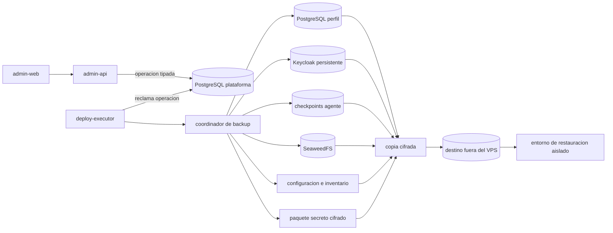
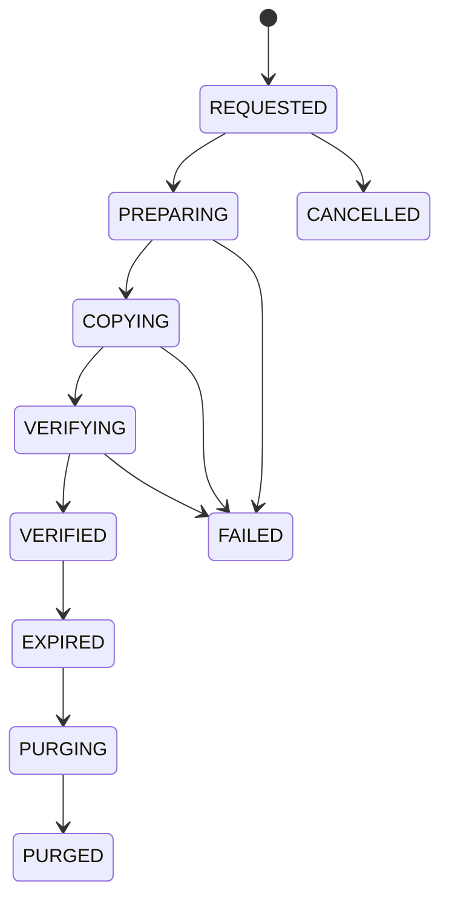
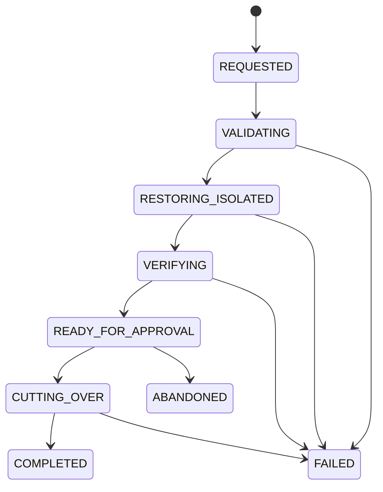

# Respaldo, restauracion y continuidad

Este documento aplica [ADR-0015](../06-decisiones/ADR-0015-respaldo-restauracion-continuidad.md) a los componentes actuales. Describe la arquitectura objetivo; no acredita backups ejecutados ni restauraciones verificadas.

## Objetivos

- Recuperar un perfil sin cruzar datos, objetos, identidad, secretos ni agentes con otro perfil.
- Sobrevivir a la perdida completa del VPS mediante una copia cifrada en otro dominio de fallo.
- Mantener un corte coherente entre PostgreSQL y las versiones inmutables de SeaweedFS.
- Distinguir rollback de aplicacion, restauracion de datos y reconstruccion de infraestructura.
- Medir RPO y RTO mediante restauraciones reales.

## Componentes y flujo

El destino externo solo recibe contenido cifrado y metadatos tecnicos minimos. Los nombres comerciales, paths internos y secretos no se usan como nombres de objetos, logs o metricas.

## Modelo operativo durable

La plataforma conserva como minimo:

| Recurso | Campos esenciales |
|---|---|
| `BackupPolicy` | propietario, alcance, frecuencia, retencion, objetivos, destino registrado y estado |
| `BackupSet` | ID, perfil o plataforma, generacion, cutoff, LSN, release, config revision, estado y expiracion |
| `BackupComponent` | tipo, repositorio, version, checksum, bytes, inicio, fin y resultado |
| `ObjectManifest` | `fileId`, estado, zona, key interna, `versionId`, SHA-256 y proteccion de borrado |
| `RestoreOperation` | backup, destino, modo, actor, aprobaciones, pasos, resultado y mediciones |
| `RecoveryEvidence` | verificaciones, conteos, smoke tests, RPO observado, RTO observado y artefactos redactados |

No se guardan claves, credenciales, dumps, WAL ni contenido de archivos en la base administrativa. Se guardan referencias opacas y evidencia segura.

## Estados

### Backup

- Solo `VERIFIED` es elegible para restauracion.
- `FAILED` conserva causa, componente y evidencia, y libera de forma segura el barrier de objetos.
- La expiracion no elimina una generacion con restauracion activa, legal hold o dependencia de otra copia.
- Purgar es idempotente y verifica ausencia antes de finalizar.

### Restauracion

`READY_FOR_APPROVAL` incluye el punto seleccionado, la perdida esperada, resultados, incompatibilidades y plan de cutover. La doble confirmacion no reemplaza permisos ni precondiciones tecnicas.

## Creacion de un backup coordinado

1. `admin-api` autoriza y registra `BackupSet` con clave idempotente.
2. `deploy-executor` adquiere lock del perfil y una generacion de backup. No bloquea lecturas ni escrituras ordinarias mas tiempo del necesario para fijar el corte.
3. El modulo `files` crea dentro de PostgreSQL el manifiesto y protege las versiones contra borrado.
4. El mecanismo PostgreSQL inicia o vincula un base backup y fija LSN/cutoff; el archivo continuo de WAL permite alcanzar ese punto.
5. Se copian las versiones exactas de SeaweedFS, configuracion, identidad, checkpoints y paquete cifrado de secretos.
6. Cada componente calcula checksum y registra bytes y tiempos observados.
7. La verificacion confirma WAL sin huecos, manifiesto completo, checksums, cifrado, release y config revision.
8. Solo entonces el conjunto pasa a `VERIFIED`; se libera el barrier y se aplican retencion y alertas.

Un timeout, reinicio o respuesta incierta se reconcilia observando repositorio, version y checksum antes de repetir. La misma clave idempotente nunca crea dos conjuntos logicos.

## Restauracion aislada

El destino aislado usa bases, buckets, realms, DNS, colas, credenciales y claves diferentes. Por defecto no tiene salida a proveedores externos.

Orden:

1. Validar que el backup sigue `VERIFIED`, no esta expirado y sus claves estan disponibles.
2. Preparar capacidad y redes aisladas sin reutilizar identificadores operativos del origen.
3. Restaurar configuracion no secreta e inventario de release por digest.
4. Restaurar PostgreSQL hasta el LSN o instante aprobado.
5. Reconstruir buckets y copiar exactamente las versiones del manifiesto.
6. Restaurar identidad y secretos mediante sus custodios y rotar credenciales si hubo compromiso.
7. Restaurar checkpoints solo si la version del grafo y la ejecucion son compatibles; en otro caso cerrar o reiniciar explicitamente.
8. Mantener pausados workers, agentes, automatizaciones, correo, canales, pagos, calendarios y webhooks.
9. Verificar migraciones, conteos, constraints, referencias, SHA-256, permisos, aislamiento y smoke tests.
10. Calcular RPO/RTO observados y producir evidencia redactada.

Una restauracion de prueba termina destruyendo de forma autorizada el entorno temporal y comprobando su ausencia. Un cutover productivo conserva el origen en solo lectura o aislado hasta verificar el destino y completar la ventana de recuperacion.

## Tipos de recuperacion

| Tipo | Uso | Datos que puede descartar | Aprobacion |
|---|---|---|---|
| Rollback de aplicacion | Volver a un digest compatible | Ninguno por diseño | Operacion de release |
| Restauracion de perfil | Recuperar datos de una empresa | Cambios posteriores al recovery point | Doble confirmacion y evidencia aislada |
| Recuperacion selectiva | Extraer recursos concretos | Depende del procedimiento | Runbook especifico; no SQL manual improvisado |
| Reconstruccion de VPS | Perdida completa del host | Hasta el RPO comun de todos los componentes | Incidente de plataforma y responsables designados |

## Seguridad

- Backup y restauracion usan principales distintos y de minimo privilegio.
- La interfaz selecciona IDs registrados; no recibe URLs, paths, comandos o credenciales libres.
- Los logs no contienen contenido, secretos, nombres de archivo, URLs firmadas ni claves de repositorio.
- El destino externo no comparte contraseña maestra, cuenta administrativa ni llave SSH con el VPS.
- La restauracion desde un origen no confiable se trata como entrada sensible: se verifica antes de ejecutar aplicaciones.
- Cualquier backup extraido para soporte conserva cifrado, acceso temporal, auditoria y eliminacion comprobada.

## Observabilidad y alertas

Metricas acotadas:

- edad del ultimo backup `VERIFIED` por perfil y tipo;
- duracion y bytes por componente y clase de entorno;
- fallos por etapa y causa clasificada;
- continuidad de WAL y retraso del destino externo;
- restauraciones probadas, RPO y RTO observados;
- capacidad, crecimiento y proximidad de expiracion.

Alertas minimas: ausencia de recovery point dentro del RPO, hueco de WAL, checksum distinto, copia parcial, destino inaccesible, clave no recuperable, retencion no aplicada, poco espacio y simulacro vencido.

IDs de tenant, backup, objeto o operacion no se usan como labels de metrica de cardinalidad no acotada. La evidencia durable vive en PostgreSQL, no en logs o paneles.

## Pruebas obligatorias

- Perder la respuesta despues de cada escritura local y remota y reconciliar sin duplicar conjuntos.
- Corromper un componente, omitir WAL y alterar un checksum; ninguno puede alcanzar `VERIFIED` ni restaurarse.
- Restaurar dos perfiles y demostrar que no cruzan bases, buckets, realms, secretos, colas o checkpoints.
- Restaurar estados de archivo `AVAILABLE`, `DELETE_SCHEDULED`, `DELETE_PENDING`, `QUARANTINED` y metadatos sin bytes.
- Comprobar que no se emiten mensajes, pagos, reservas, correos, webhooks ni acciones agentivas durante el simulacro.
- Perder Redis y recuperar operaciones desde PostgreSQL.
- Reintentar, cancelar y reanudar backup y restauracion en cada etapa segura.
- Rotar credenciales del origen y del destino sin perder recovery points validos.
- Reconstruir un host sin leer discos o secretos del VPS perdido.

## Condiciones antes de datos reales

- Destino externo contratado o provisionado y medido.
- Claves y custodios probados fuera del VPS.
- Capacidad suficiente para retencion y restauracion temporal.
- Perfil completo restaurado dentro de objetivos.
- VPS reconstruido desde cero dentro de objetivos.
- Alertas y responsables activos.
- Runbooks ejecutables derivados de la implementacion real.

## Referencias

- [ADR-0015](../06-decisiones/ADR-0015-respaldo-restauracion-continuidad.md)
- [ADR-0013: archivos y objetos](../06-decisiones/ADR-0013-archivos-almacenamiento-objetos.md)
- [Reglas de respaldo y continuidad](../05-reglas/14-respaldo-restauracion-continuidad.md)
- [Operaciones y despliegues](../03-operaciones/despliegues.md)
